# CHAPTER 3 · Transport Layer

## 3.1 Introduction and Transport-Layer Services

A transport-layer protocol provides for **logical communication** between application processes running on different hosts. Processes can use it without considering the details of connection.

It will convert the messages into transport-layer packets by breaking them into several chunks and add headers.

### 3.1.1 Relationship Between Transport and Network Layers

Transport-layer protocol is analogy to Ann and Bill who collect and distribute the letter to each kid. The network-layer protocol is analogy to postal service.

### 3.1.2 Overview of the Transport Layer in the Internet

- **UDP** (User Datagram Protocol)

  connectionless, best-effort service

- **TCP** (Transmission Control Protocol)

  reliable, flow-and congestion-controlled connection-oriented transport 

IP is said to be an **unreliable service**, but TCP could convert it to a reliable data transport service. 

Extending host-to-host delivery to process-to-process is called **transport-layer multiplexing** and **demultiplexing**


## 3.2 Multiplexing and Demultiplexing

In sending end, the transport layer gathers data chunks from different sockets and adds header to create segments, then passes it to the network layer, and this action is called **Multiplexing**.

Similarly, in receiving end, the transport receives data from the network layers, and directs the segment to specific socket. This is called **Demultiplexing**.

---

**transport-layer multiplexing requires**

1. that sockets have unique identifiers
2. that each segment have special fields that indicate the socket to which the segment is to be delivered. Those are the **source port number field** and the **destination port number field** as shown below.

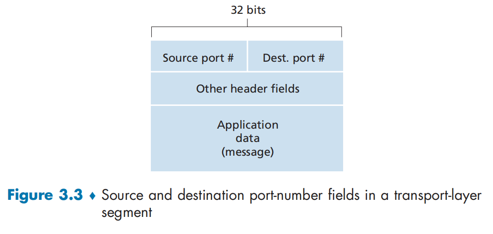

Each port number is a 16-bit number, ranging from 0 t0 65535.

**well-know port numbers**： 0 ~ 1023

#### Connectionless Multiplexing and Demultiplexing

When we use this command

```python
clientSocket = socket(AF_INET, SOCK_DGRAM)
```

The transport layer assign a port number in the range 1-24 to 65535 that is currently not used by any other UDP port in the host.

We can also to assign a specific port number using the command below.

```python
clientSocket.bind(('', 19157))
```

UDP socket is fully identified a two-tuple `(destination IP, destination port number)` 

**What is the purpose of the source port number ?**

The server will send a new segment to the client, with the extracted source port number serving as the destination port number in this new segment.

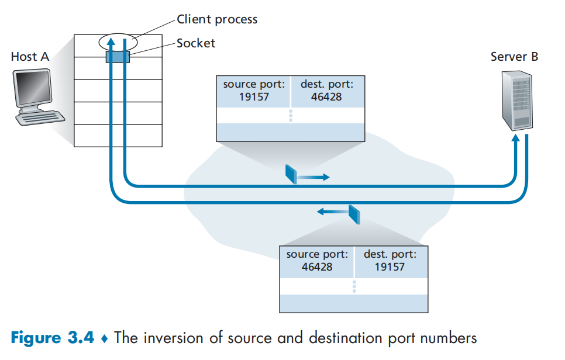

#### Connection-Oriented Multiplexing and Demultiplexing

TCP socket is identified by a four-tuple `(source IP address, source port number, destination P address, destionation port number)`

When server receives the incoming connection-request segment with specific port number, it will create a new socket:

```python
connectionSocket, addr = serverSocket.accept()
```

if the next request has a different 'four-tuple', a new connect will be created on this port.

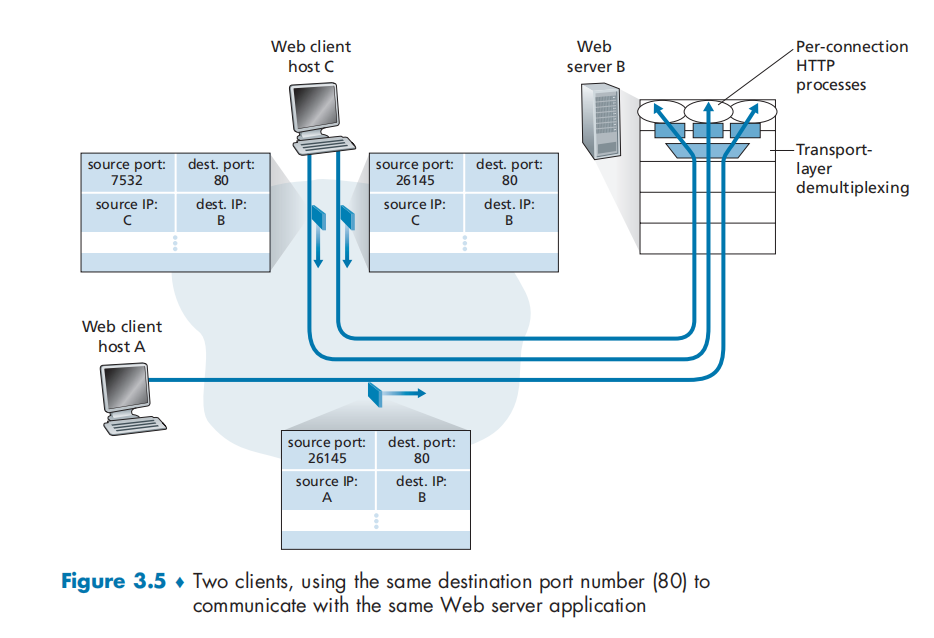

> **Security**
>
> Determining which applications are listening on which ports is a relatively easy task. Indeed there are a number of public domain programs, called port scanners, that do just that. Perhaps the most widely used of these is `nmap`, freely available at http://nmap.org and included in most Linux distributions. For TCP, `nmap` sequentially scans ports, looking for ports that are accepting TCP connections. For UDP, `nmap` again sequentially scans ports, looking for UDP ports that respond to transmitted UDP segments. 

#### Web Server and TCP

Figure 3.5 shows a Web server that spawns a new process for each connection. However, today's Web server often process each connection with different thread of the same process.


## 3.3 Connectionless Transport: UDP

**The reason to use UDP**

- *Finer application-level control over what data is sent, and when.* It could meet the real-time  applications' requirement.
- *No connection establishment* 
- *No connection state* 
- *Small packet header overhead.* The TCP segment has 20 bytes of header overhead in every segment, whereas UDP has only 8 bytes of overhead.

The most recent versions of HTTP run over UDP, providing their own error control and congestion control at the application layer.

### 3.3.1 UDP Segment Structure

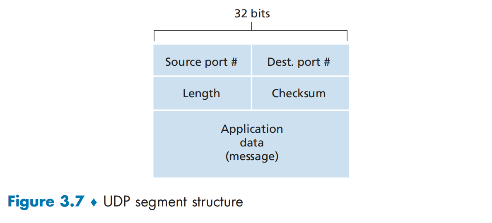

UDP header has only four fields,  each consisting of two bytes.

`Length` field specifies the number of bytes in the UDP segment(header plus data).

`Checksum` field is used by the receiving host to check whether errors have been introduced into the segment.

### 3.3.2 UDP Checksum

The checksum is used to determine whether bits within the UDP segment have been altered as it moved from source to destination.

- **sender side: **performing the 1 complement of the sum of all the 16-bit words in the segment.
- **receiver side: **all four 16-bit words are added, including the checksum. if overflow occurs, it will be wrapped around. If no errors are introduced into the packet, then the sum at the receiver will be 1111111111111111.


## 3.4 Principles of Reliable Data Transfer

TCP is a reliable data transfer protocol that is implemented on top of an unreliable (IP) end-to-end network layer. 

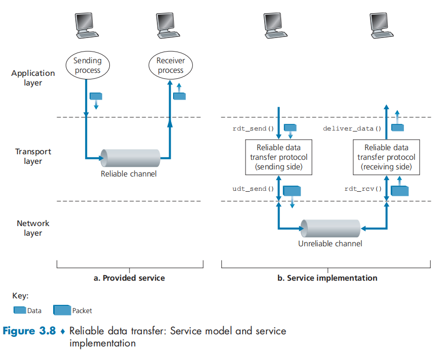

### 3.4.1 Building a Reliable Data Transfer Protocol

#### Reliable Data Transfer over a Perfectly Reliable Channel: rdt1.0

finite-state machine (FSM)

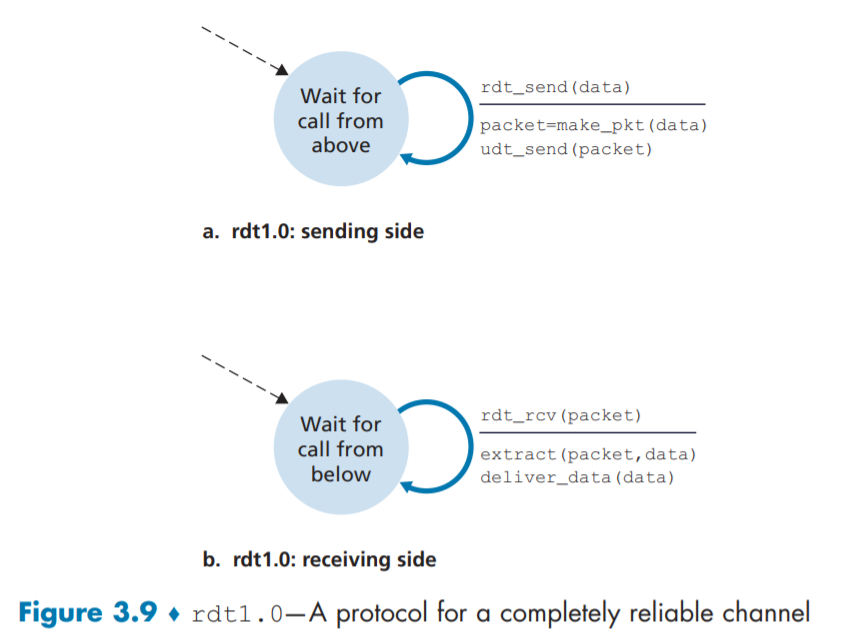

We assume that the channel is reliable and fast enough to transfer packet.

#### Reliable Data Transfer over a Channel with Bit Errors: rdt2.0

We'll continue to assume for the moment that all transmitted packets are received in the order in which they were sent.

This message-dictation protocol uses both **positive acknowledgments** (“OK”) and **negative acknowledgments** (“Please repeat that.”). In a computer network setting, reliable data transfer protocols based on such retransmission are known as **ARQ (Automatic Repeat reQuest) protocols**


3 additional protocol capabilities

- *Error detection.* UDP uses the Internet checksum field for this purpose.
- *receiver feedback.*  
- Retransmission.


the FSM representation of rdt2.0:

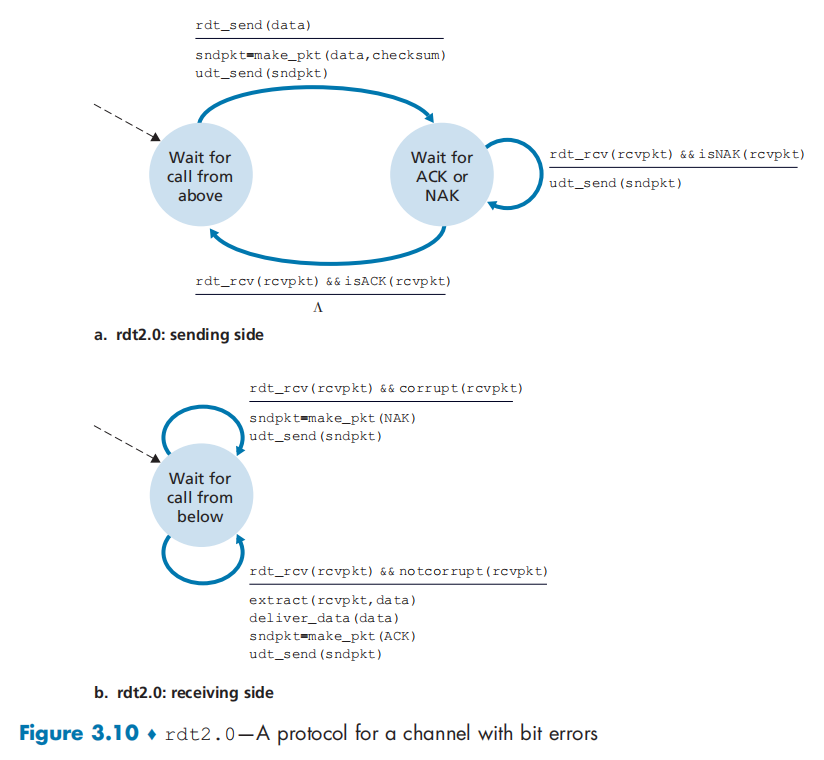

But the ACK/NAK could be corrupted.

Sender will resend the data when it receives a garbled ACK or NAK packet. However, a new problem is that, the receiver don't down whether a packet is new data or a retransmission.

so we add a new field to the data packet and have the sender number its data packets by putting a **sequence number** into this field. In this simple example, we use 1-bit status.

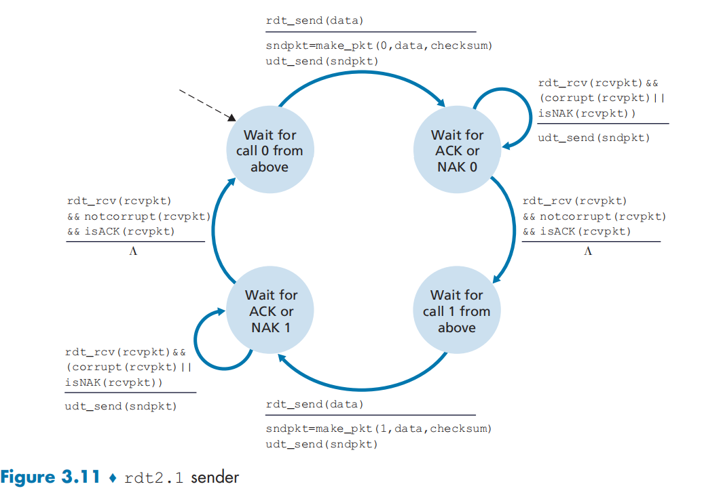

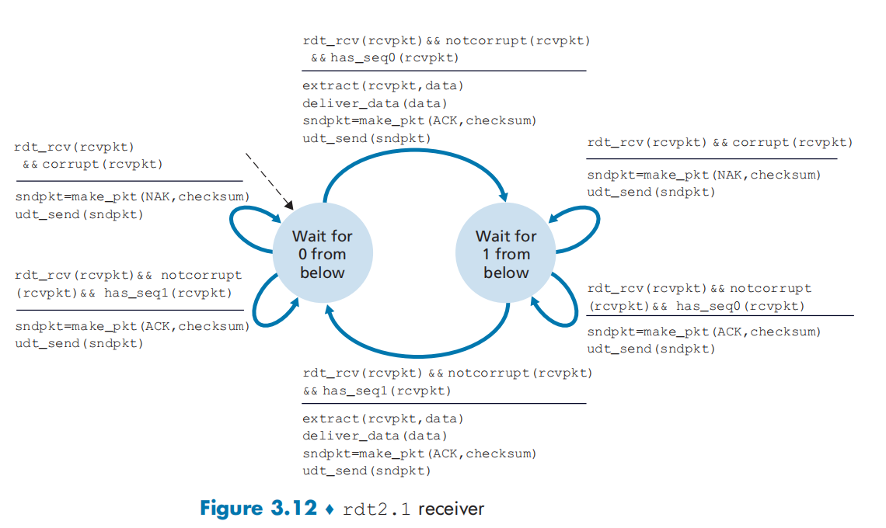

Instead of sending NAK, we can send an ACK for the last last correctly received packet. a sender that receives two ACKs for the same packet(that is, receives **duplicate ACKs**) knows that the receiver did not correctly receive the packet following the packet that is being ACKed twice. NAK-free reliable data transfer protocol - **rdt2.2**

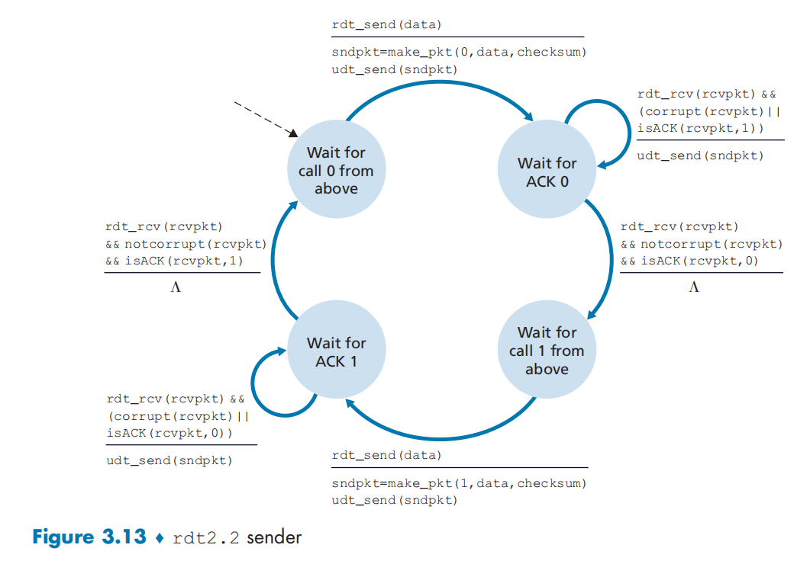

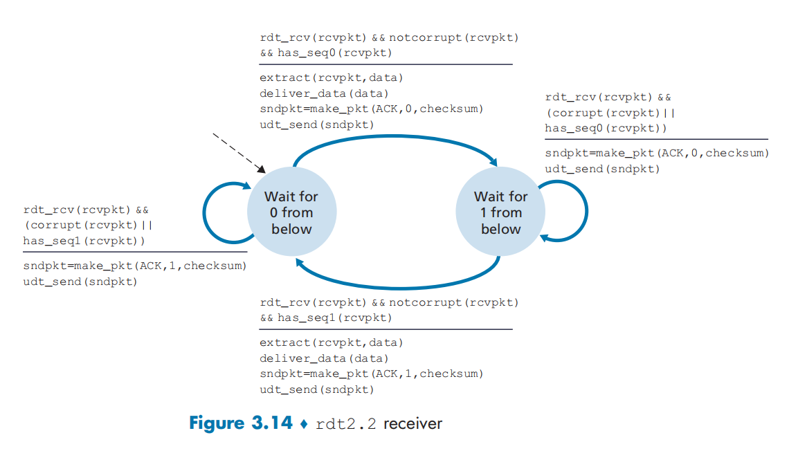

#### Reliable Data Transfer over a Lossy Channel with Bit Errors: rdt3.0

To handle the case that a packet may be lost in the channel, the sender will retransmit the packet after a delay.

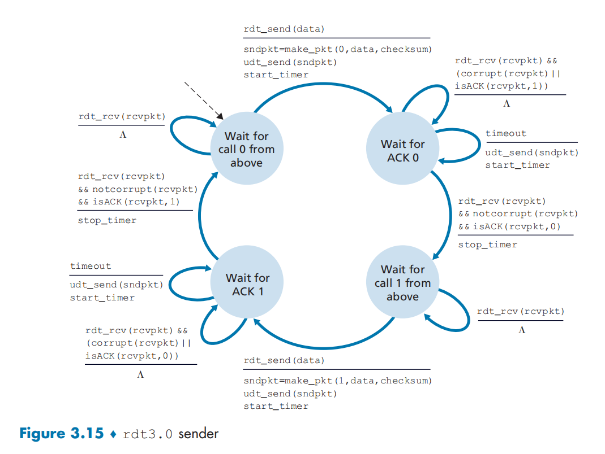

Protocol rdt3.0 is sometimes known as the alternating-bit protocol.

### 3.4.2 Pipelined Reliable Data Transfer Protocols

The efficiency of stop-and-wait protocol is too low, so we use a technology called **pipelining** to send multiple packets without waiting for acknowledgment.

3 consequences:

- The range of sequence numbers must be increased .
- The sender and receiver sides of the protocols may have to buffer more than one packet.
- The range of sequence numbers needed and the buffering requirements will depend on the manner in which a data transfer protocol responds to lost, corrupted, and overly delayed packets. Two basic approaches toward pipelined error recovery can be identified: **Go-Back-N** and **selective repeat**.

### 3.4.3 Go-Back-N(GBN)

A good [Simulation](https://media.pearsoncmg.com/ph/esm/ecs_kurose_compnetwork_8/cw/content/interactiveanimations/go-back-n-protocol/index.html)

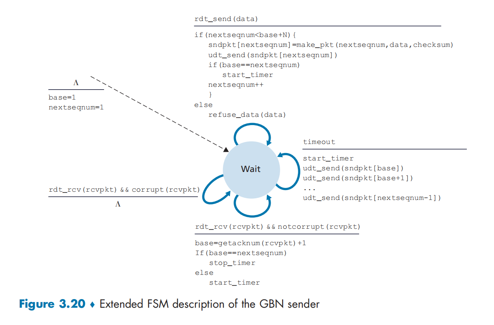

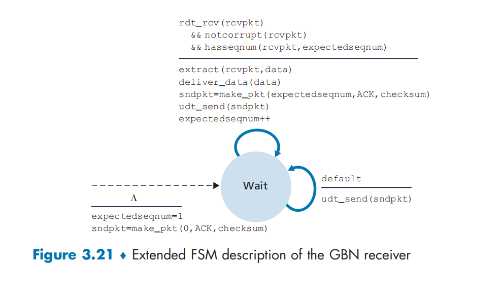

but it has a shortcoming that the received packet after the loss packet will be discarded.

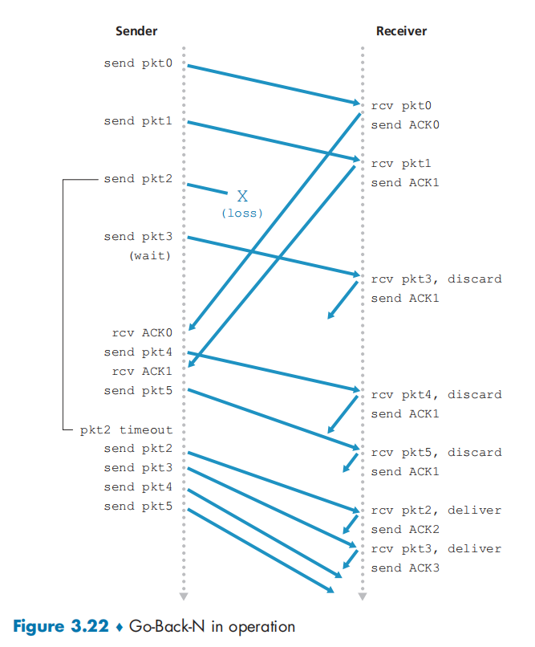

### 3.4.4 Selective Repeat (SR)

A good [simulation](https://media.pearsoncmg.com/ph/esm/ecs_kurose_compnetwork_8/cw/content/interactiveanimations/selective-repeat-protocol/index.html)

## 3.5 Connection-Oriented Transport: TCP

### 3.5.1 The TCP Connection

A TCP connection provides a **full-duplex service** and it's always **point to point**.

TCP directs this data to the connection's **send buffer**, which is one of that is set aside during the initial three-way handshake. The maximum amount of data that can be grabbed and placed in a segment is limited by the **maximum segment size (MSS)**. The MSS is typically set by first determining the length of the largest link-layer frame that can be sent by the local sending host (the so-called **maximum transmission unit,** **MTU**), and then setting the MSS to ensure that a TCP segment (when encapsulated in an IP datagram) plus the TCP/IP header length (typically 40 bytes) will fit into a single link-layer frame. Both Ethernet and PPP link-layer protocols have an MTU of 1,500 bytes. 

### 3.5.2 TCP Segment Structure

`TCP segment` - (`header fields` and `data fields` )

- `header fields`： 

- `data fields`: application data

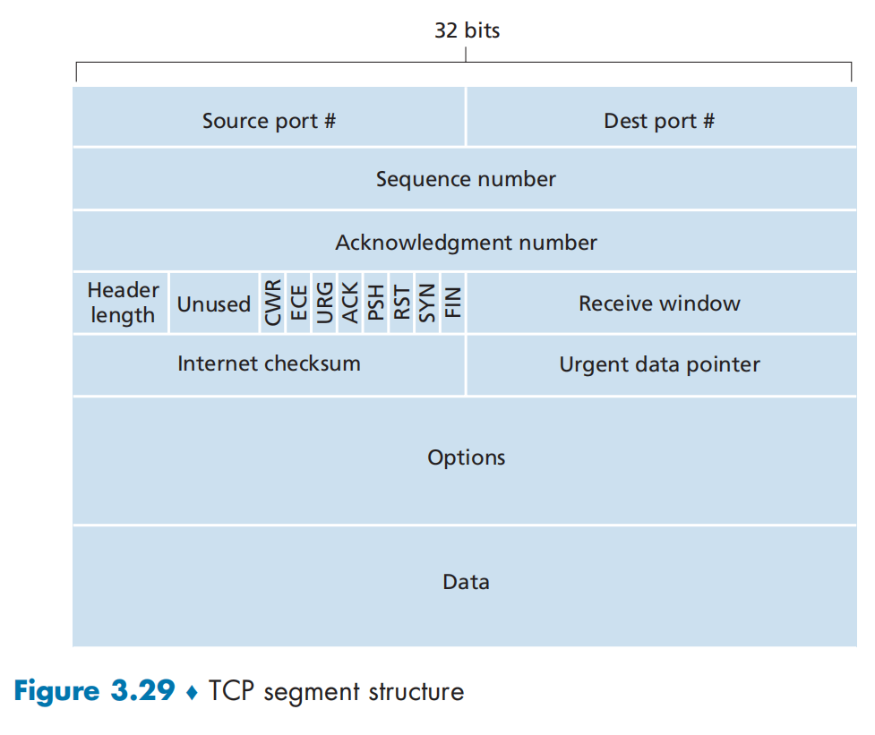

#### Sequence Number and Acknowledgement Number

**Sequence Number **

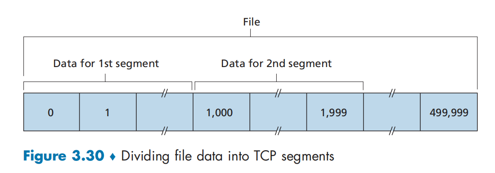

The number of first data byte in each segment.

**Acknowledgement Number**

The next Sequence Number.

### 3.5.3 Round-Trip Time Estimation and Timeout

### 3.5.4 Reliable Data Transfer

### 3.5.5 Flow Control

### 3.5.6 TCP Connection Management

## 3.6 Principles of Congestion Control

