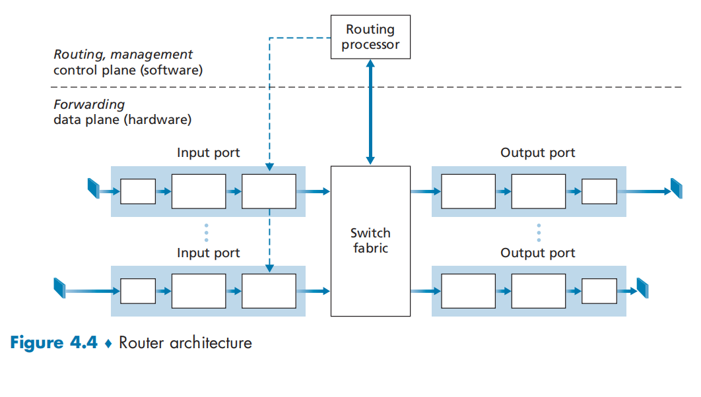
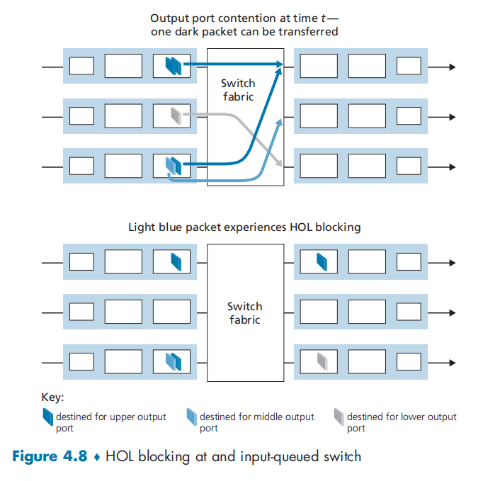
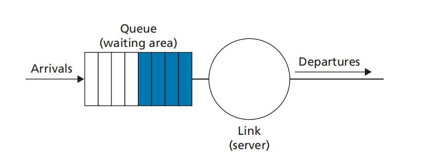
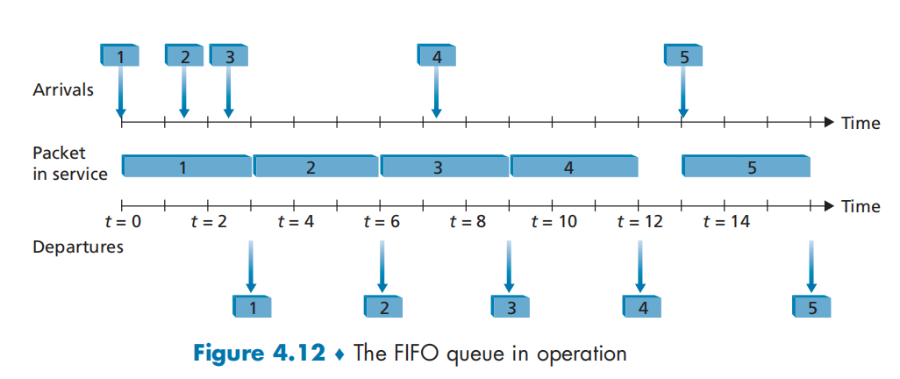
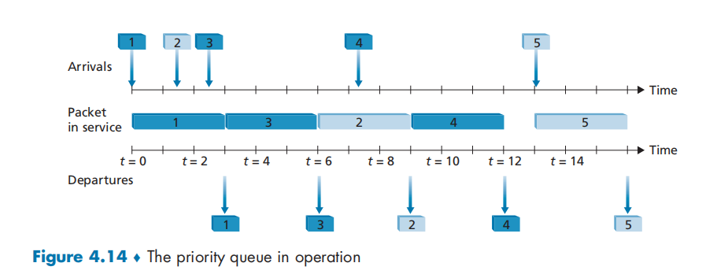
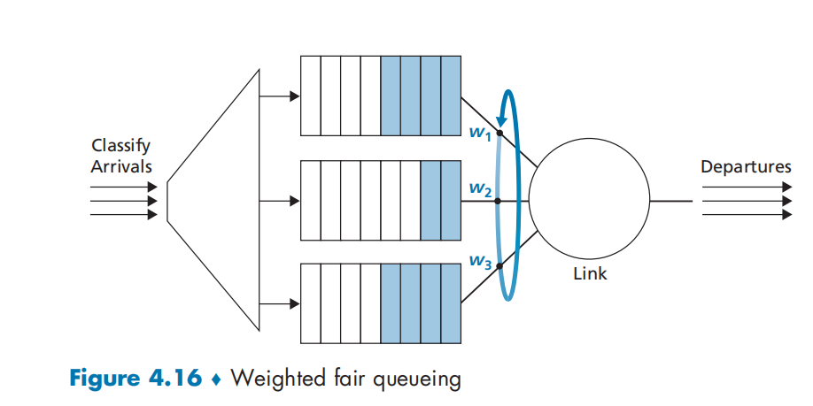

# CHAPTER 4 - The Network Layer: Data Plane

## 4.1 Overview of Network Layer 

### 4.1.1 Forwarding and Routing: The Data and Control Planes 

Two important network-layer functions:

- Forwarding 

- Routing 

A key element in every network router is its **forwarding table**.

**Control Plane: The Traditional Approach**

There is a algorithm to determine the forwarding table.

**Control Plane: The SDN Approach**

The routing device performs forwarding only, while the remote controller computes and distributes forwarding tables.

`software-defined networking(SDN)`, where the network is "software-defined" because the controller that computes forwarding tables and interacts with routers is implemented in software.

### 4.1.2 Network Service Model 

Consider some 0possible services that the network layer could provide. These services could include:

- Guaranteed delivery
- Guaranteed delivery with bounded delay.
- In-order packet delivery.
- Guaranteed minimal bandwidth. 
- Security

The Internet's network layer provides a single service, known as **best-effort service**.

## 4.2 What's Inside a Router?

A high-level view of a generic router architecture:

- Input ports. 
- Switch fabric.
- output ports 
- Routing processor.

what information is require for this processing:

- Destination-based forwarding. 
- Generalized forwarding.

### 4.2.1 Input Port Processing and Destination-Based Forwarding

 blocking**

**Output Queueing**

$R_{switch}$ is again N times faster than $R_{line}$ and the packets arriving at each of the N input ports are destined to the same output port.

A decision must be made to either drop the arriving packet (a policy known as drop-tail) or remove one or more already-queued packets to make room for the newly arrived packet.

A number of proactive packet-dropping and -marking policies (which collectively have become known as **active queue management (AQM)** algorithms) have been proposed and analyzed. One of the most widely studied and implemented AQM algorithms is the **Random Early Detection (RED)** algorithm.

**How Much Buffering Is "Enough?"**

$B = RTT * C$

$B = RTT * C / \sqrt N$

large buffer will contribute to delay

### 4.2.5 Packet Scheduling

**First-in-First-Out(FIFO)**

**Priority Queuing**

Under priority queuing, packets arriving at the output link are classified into priority classes upon arrival at the queue.

The packet with high priority will be selected firstly.

**Round Robin and Weighted Fair Queuing(WFQ)**

Packets are sorted into classes as  with priority queuing. However, rather than there being a strict service priority among classes, a round robin scheduler alternates service among the classes.

A generalized form of round robin queuing that has been widely implemented in routers is the so-called **Weighted fair queueing (WFQ) discipline** 

Every class has a weight $w_i$, and it will get the rate at least $w_i / \sum W_{i}$

