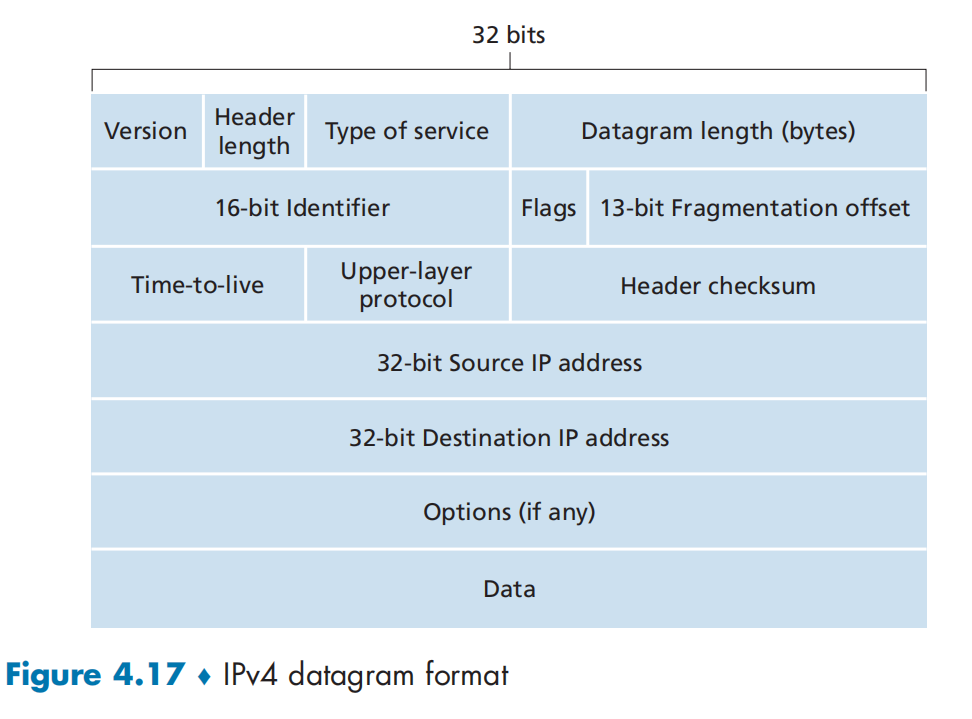
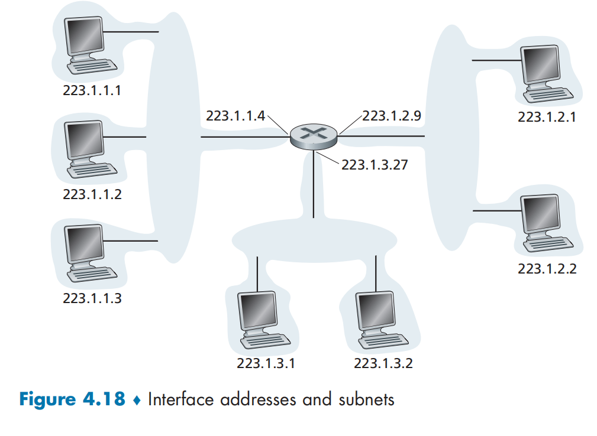
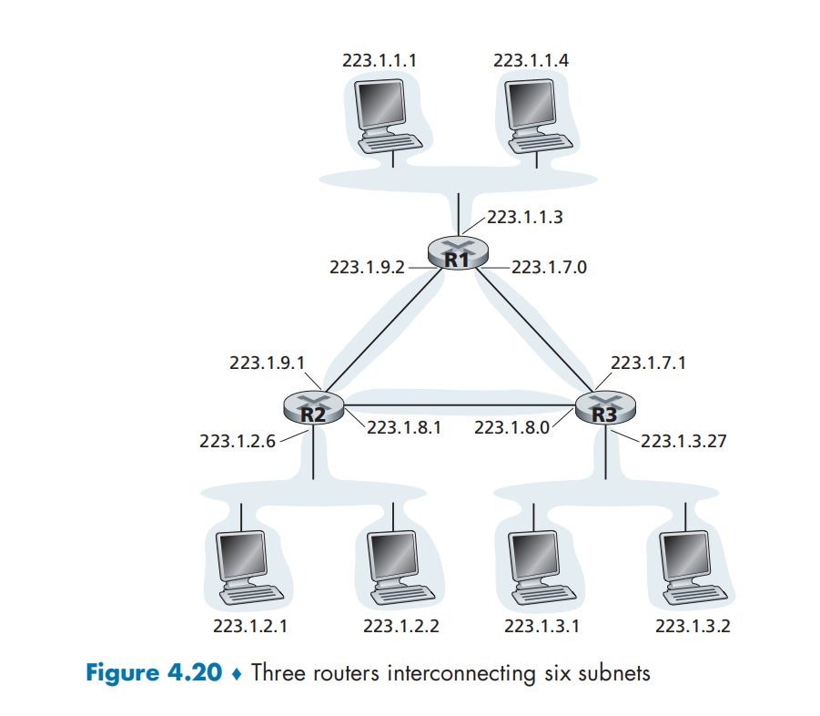
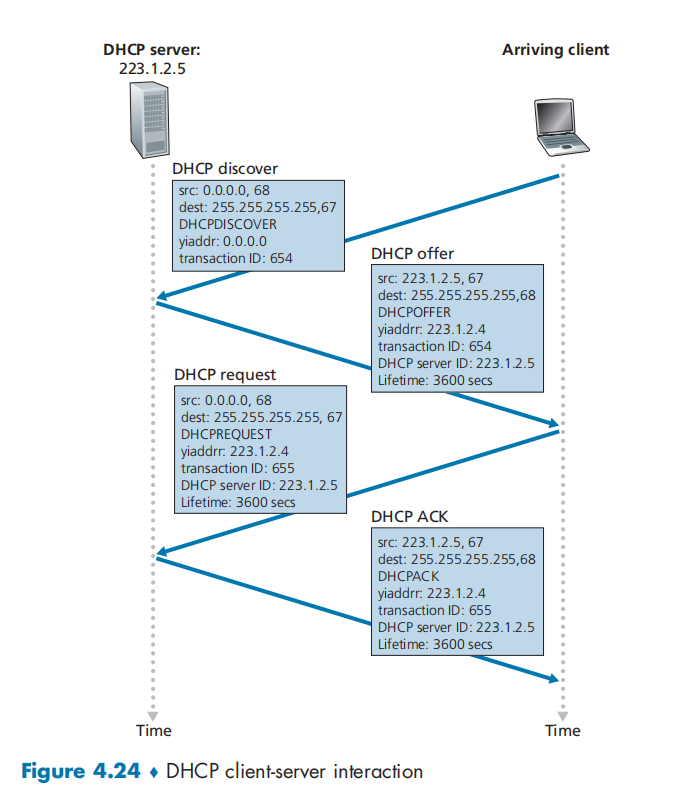
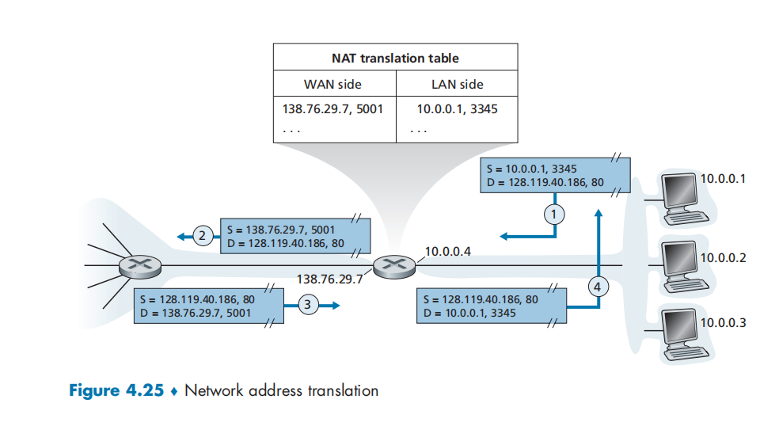
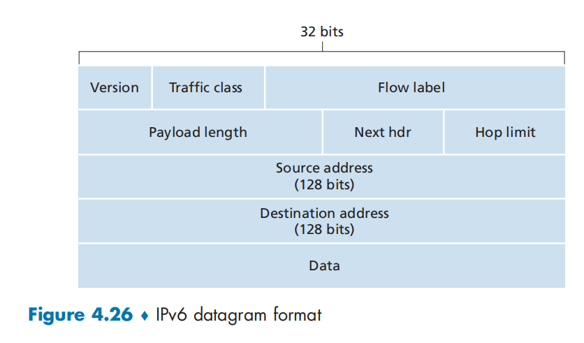
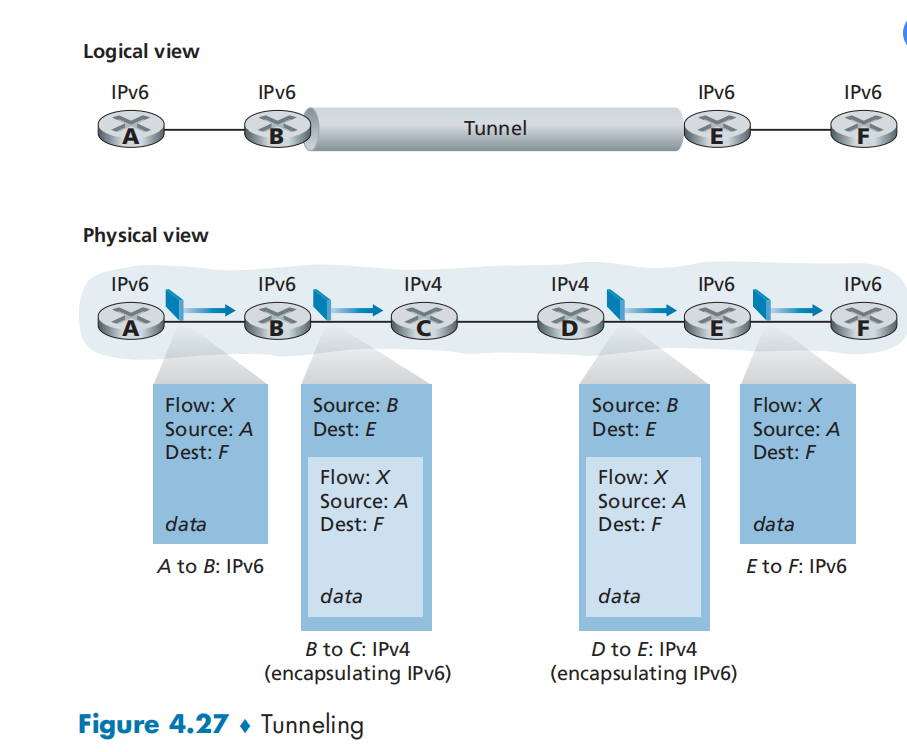
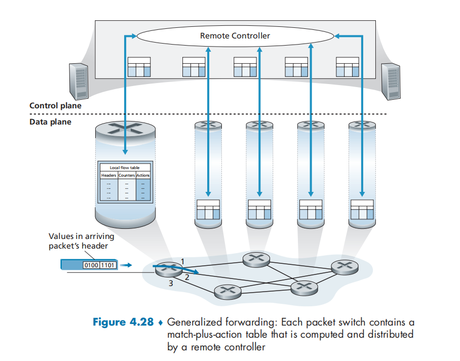
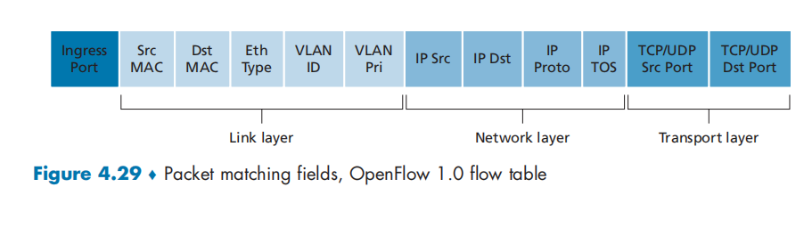
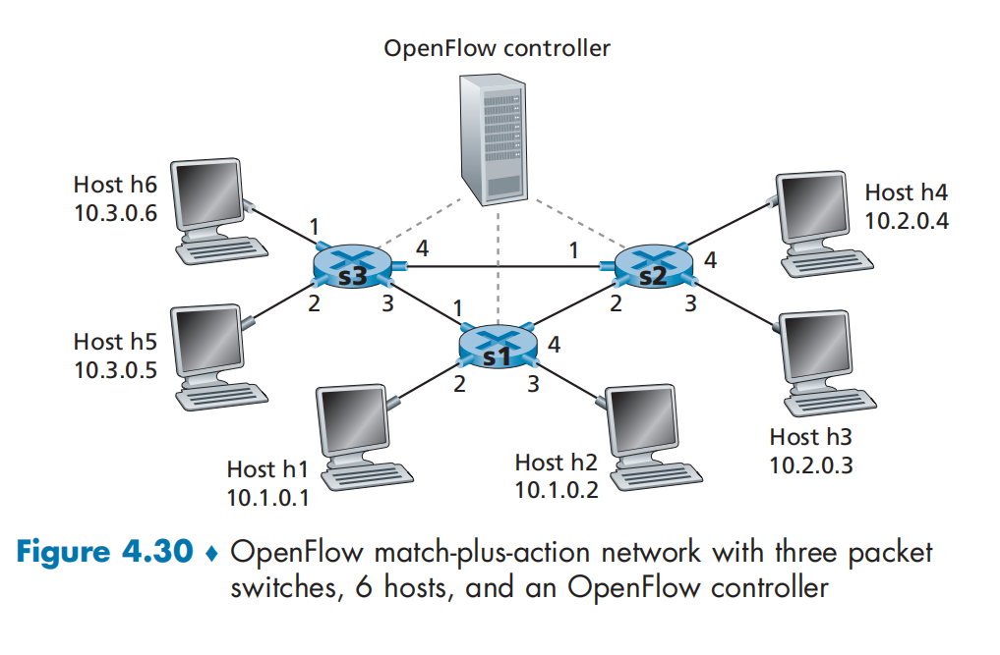

# CHAPTER 4 - The Network Layer: Data Plane

## 4.1 Overview of Network Layer 

### 4.1.1 Forwarding and Routing: The Data and Control Planes 

Two important network-layer functions:

- Forwarding 

- Routing 

A key element in every network router is its **forwarding table**.

**Control Plane: The Traditional Approach**

There is a algorithm to determine the forwarding table.

**Control Plane: The SDN Approach**

The routing device performs forwarding only, while the remote controller computes and distributes forwarding tables.

`software-defined networking(SDN)`, where the network is "software-defined" because the controller that computes forwarding tables and interacts with routers is implemented in software.

### 4.1.2 Network Service Model 

Consider some 0possible services that the network layer could provide. These services could include:

- Guaranteed delivery
- Guaranteed delivery with bounded delay.
- In-order packet delivery.
- Guaranteed minimal bandwidth. 
- Security

The Internet's network layer provides a single service, known as **best-effort service**.

## 4.2 What's Inside a Router?

A high-level view of a generic router architecture:

- Input ports. 
- Switch fabric.
- output ports 
- Routing processor.

what information is require for this processing:

- Destination-based forwarding. 
- Generalized forwarding.

### 4.2.1 Input Port Processing and Destination-Based Forwarding

With this style of forwarding table, the router matches a prefix of the packet's destination address with the entries in the table.

When there are multiple matches, the router used the **longest prefix matching rule**.

### 4.2.2  Switching

Switching can be accomplished in a number of ways.

- Switching via memory.
- Switching via a bus.
- Switching via an interconnection network               

### 4.2.3 Output Port Processing

### 4.2.4 Where Does Queuing Occur?

If $R_{switch}$ is N times faster than $R_{line}$, then only negligible queuing will occur at the input ports.

**Input Queueing**

**head-of-the-line(HOL) blocking**

**Output Queueing**

$R_{switch}$ is again N times faster than $R_{line}$ and the packets arriving at each of the N input ports are destined to the same output port.

A decision must be made to either drop the arriving packet (a policy known as drop-tail) or remove one or more already-queued packets to make room for the newly arrived packet.

A number of proactive packet-dropping and -marking policies (which collectively have become known as **active queue management (AQM)** algorithms) have been proposed and analyzed. One of the most widely studied and implemented AQM algorithms is the **Random Early Detection (RED)** algorithm.

**How Much Buffering Is "Enough?"**

$B = RTT * C$

$B = RTT * C / \sqrt N$

large buffer will contribute to delay

### 4.2.5 Packet Scheduling

**First-in-First-Out(FIFO)**

**Priority Queuing**

Under priority queuing, packets arriving at the output link are classified into priority classes upon arrival at the queue.

The packet with high priority will be selected firstly.

**Round Robin and Weighted Fair Queuing(WFQ)**

Packets are sorted into classes as  with priority queuing. However, rather than there being a strict service priority among classes, a round robin scheduler alternates service among the classes.

A generalized form of round robin queuing that has been widely implemented in routers is the so-called **Weighted fair queueing (WFQ) discipline** 

Every class has a weight $w_i$, and it will get the rate at least $w_i / \sum W_{i}$

## 4.3 The Internet Protocol (IP): IPv4, Addressing, Ipv6, and More

### 4.3.1 IPv4 Datagram Format

- Version number. 
- Header length. Most IP datagrams do not contain options, so the typical IP datagram has a 20-byte header.
- Type of service (TOS). For example, it might be useful to distinguish real-time traffic. 
- Datagram length. Since this field is 16 bits long, the theoretical maximum size of the IP datagram is 65535 bytes. However, datagrams are rarely larger than 1500 bytes, which allows an IP datagram to fit in the payload field of a maximally sized Ethernet frame.
- indentifier, flags, fragmentation offset.  These are used for IP fragmentation. However, IPv6 does not allow for fragmentation.
- Time-to-live. ensure that datagrams do not circulate forever in the network. If the TTL field reaches 0, a router must drop that datagram.
- Protocol. The value of this field indicates the specific transport-layer protocol to which the data portion of this IP datagram should be passed. 
- Header checksum. The header checksum aids a router in detecting bit errors in a received IP datagram. Routers typically discard datagrams for which an error has been detected. Note that the checksum must be recomputed and stored again at each router, since since the TTL field, and possibly the options field as well, will change.
- Source and destination IP addresses. 
- Options. The options fields allow an IP header to be extended. IP options were not included in the IPv6 header.
- Data(payload). 

IP datagram has a total of 20 bytes of header (assuming no options). If the datagram carries a TCP segment, then each datagram carries a TCP segment, then each datagram carries a total of 40 bytes of header along with the application-layer message.

### 4.3.2 IPv4 Addressing

The boundary between the host and the physical link is called an **interface**. The boundary between the router and any one of its links is also called an interface. IP require each host and router interface to have its own IP address. Thus, an IP address is technically associated with an interface, rather than with the host or router contain.

In IP terms, this network interconnection three host interfaces and one router interface forms a **subnet**. (A subnet is also called an IP network or simply a network in the Internet literature.). IP addressing assigns an address to this subnet: 233.1.1.0.24, where the /24 notation, sometimes known as a **subnet mask**, indicates that the leftmost 24 bits of the 32-bit quantity define the subnet address. 

The 223.1.1.0/24 subnet thus consists of the three host interfaces (223.1.1.1, 223.1.1.2, and 223.1.1.3) and one router interface (223.1.1.4).

But note that there are three additional subnets in this example as well: one subnet, 223.1.0.0/24, for the interfaces that connect routers R1 and R2; 

> To determine the subnets, detach each interface from its host or router, creating islands of isolated networks, with interfaces terminating the end points of the isolated networks. Each of these isolated networks is called **subnet**

**How addressing is handled in the global Internet?**

The Internet's address assignment strategy is known as **Classless Interdomain Routing(CIDR)**

CIDR generalizes the notion of subnet addressing. As with subnet addressing, the 32-bit IP address is divided into two parts and again has the dotted-decimal form a.b.c.d/x, where x indicates the number of bits in the first part of the address.

when a router outside the organization forwards a datagram whose destination address is inside the organization , only the leading x bits of the address need be considered. 

Before CIDR was adopted, the network portions of an IP address were constrained to be 8, 16, or 24 bits subnet addressed were known as class A, B, and C networks, respectively. 

When a host sends a datagram with destination address 255.255.255.255, the message is delivered to all hosts on the same subnet. Routers optionally forward the message into neighboring subnets as well.

**How a device is assigned an address from within the organization's block of addresses?**

**Obtaining a Block of Addresses **

ISP will provide addresses from a larger block of addresses that had already been allocated to the ISP.

IP addresses are managed under the authority of the Internet Corporation for Assigned Names and Numbers (ICANN).

**Obtaining a Host Address: The Dynamic Host Configuration Protocol** 

Host addressed usually  be configured using **Dynamic Host Configuration Protocol (DHCP)** 

A network administrator can configure DHCP so that a given host receives the same IP address each time it connects to the network, or a host may be assigned a **temporary IP address** that will be different each time the host connects to the network.  DHCP also allows a host to learn additional information , such as its subnet mask, the address of its first-hop router (often called the default gateway), and the address of its' local DNS server.

In the simplest case, each subnet will have a DHCP server. If no server is present on the subnet, a DHCP relay agent that knows the address of a DHCP server for that network is needed. 

For a newly arriving host, the DHCP protocol is a four-step process. 

`youddr`(as in "your Internet address") indicates the address being allocated to the newly arriving client. 

- DHCP server discovery. 
- DHCP server offer(s). A DHCP server receiving a DHCP discover message responds to the client with a **DHCP offer message** that is broadcast to all nodes on the subnet. 
- DHCP request. The newly arriving client will choose from among one or more server offers and respond to its selected offer with a **DHCP request message**, echoing back the configuration parameters. 
- DHCP ACK. The server responds to the DCHP request message with a **DHCP ACK message** , confirming the requested parameters.

 DHCP also provides a mechanism that allows a client to renew its lease on an IP address.

### 4.3.3 Network Address Translation (NAT)

The NAT-enabled router does not look like a router to the outside world. Instead the NAT router behaves to the outside world as a single device with a single IP address. 

The router gets its address from the ISP's DHCP server, and the router runs a DHCP to provide addressed to computers within the NAT-DHCP-router-controlled home network's address space. 

The trick is to use a **NAT translation table ** at the NAT router, and to include port numbers as well as IP addressed in the table entries. 

### 4.3.4 IPv6

**IPv6 Datagram Format**

some changes:

- Expanded addressing capabilities

​		IPv6 has introduced a new type of address, called an **anycast address** that allows a datagram to be delivered to any one of a group of hosts. 

- A streamlined 40-byte header. 
- Flow labeling. IPv6 has an elusive definition of a flow. This allows "labeling of packets belonging to particular flows for which the sender requests special handling, such as a non-default quality of service or real-time service." 

The fields defined in IPv6:

- version. 
- Traffic class. It can be used to give priority to datagrams from certain applications over datagrams from other applications.
- Flow label. 
- Payload length.
- Next Header. This field identifies the protocol to which the contents (data field) of this datagram will be delivered (for example, to TCP or UDP). 
- Hop limit. 
- Source and destination addressed. 
- Data

several fields appearing in the IPv4 datagram are no longer present in the IPv6 datagram:

- Fragmentation/reassembly.
- Header checksum. 
- Options. 

**Transitioning from IPv4 to IPv6**

The approach to IPv4-to-IPv6 transition that has been most widely adopted in practice involves **tunneling**. 

## 4.4 Generalized Forwarding and SDN

OpenFlow - a highly visible standard that has pioneered the notion of the match-plus action forwarding abstraction and controllers.

Each entry in the match-plus-action forwarding table, known as a **flow table** in OpenFlow, includes:

- **A set of header field values** to which an incoming packet will be matched. 
- **A set of counters** that are updated as packets are matched to flow table entries.
- **A set of actions** to be taken when a packet matches a flow table entry.

### 4.4.1 Match

### 4.4.2 Action

Among the most important possible actions are:

- Forwarding
- Dropping
- Modify-field

### 4.4.3 OpenFlow Examples of Match-plus-action in Action

**Simple Forwarding**

**Load Balancing**

**Firewalling**

