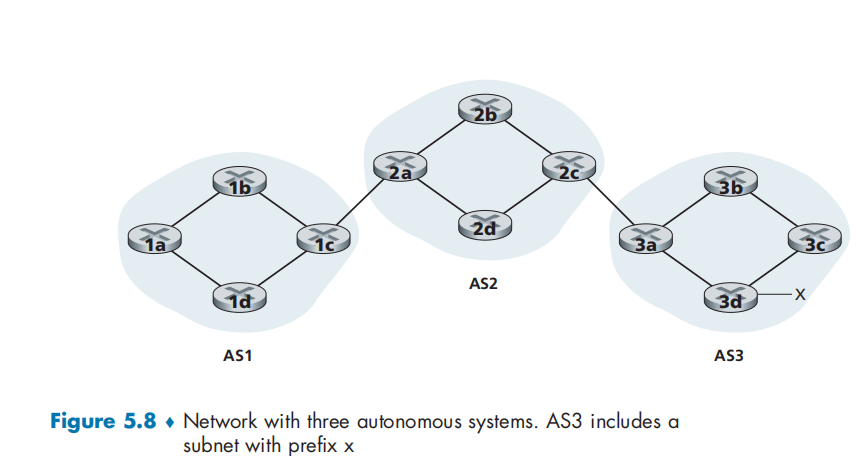
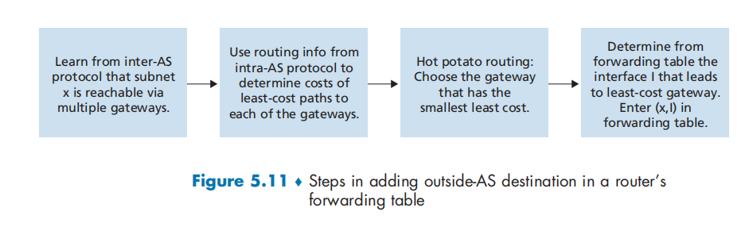
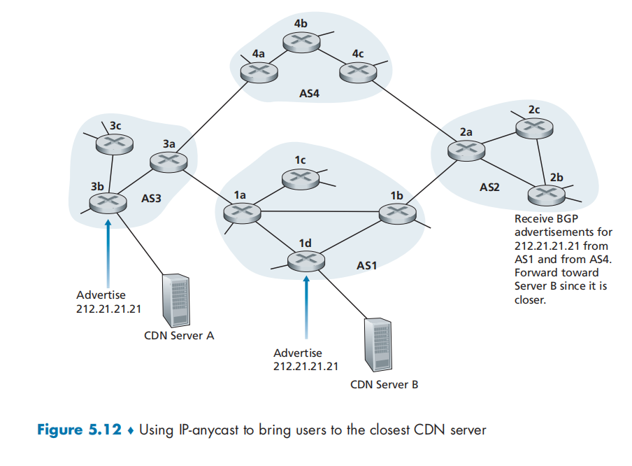
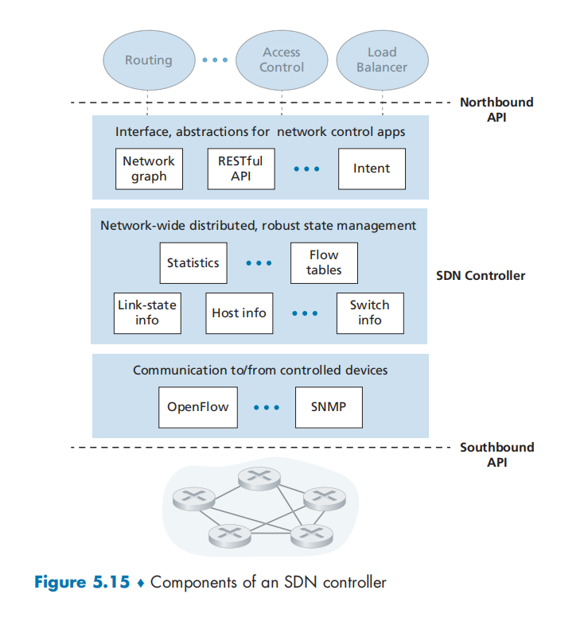
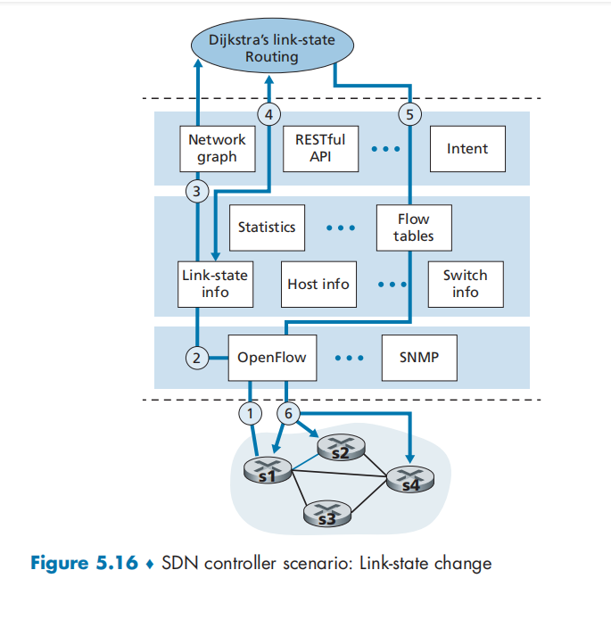

# CHAPTER 5 - The Network Layer: Control Plane

## 5.1 Introduction 

There are two possible approaches for computing, maintaining and installing forwarding and flow tables.

- Per-router control. 	Both a forwarding and a routing function are contained within each router. 
- Logically centralized control.  The controller interacts with a control agent (CA) in each of the routers via a well-defined protocol to configure and manage that router's flow table.        

## 5.2 Routing Algorithms

Routing algorithms' goal is to determine good paths, from senders to receivers, through the network of routers.

Graph

An edge also has a value representing tis cost. Typically, an edge's cost may reflect the physical length of the corresponding link(for example, a transoceanic link might have a higher cost than a short-haul terrestrial link), the link speed, or the monetary cost associated with a link.

We denote c(x, y) as the cost of the edge between nodes x and y. If the pair (x, y) does not belong to E, we set $c(x, y) = \infin$ .

The shortest path.

Broadly, one way in which we can classify routing algorithms is according to whether they are centralized or decentralized. 

- **A centralized routing algorithm.**      Algorithms with global state information are often referred to as **link-state (LS) algorithms**.
- **decentralized routing algorithm**.

A second broad way to classify routing algorithm is according to whether they are static or dynamic. In **static routing algorithms**, routers change very slowly over time, often as a result of human intervention. **Dynamic routing algorithms** change the routing paths as the network traffic loads or topology change.

A third way to classify routing algorithms is according to whether they are load-sensitive or load-insensitive. In a **Load-sensitive algorithm**, link costs vary dynamically to reflect the current level of congestion in the underlying link. Today's Internet routing algorithm are **load-insensitive**，as a link's cost does not explicitly reflect it's current level of congestion. 

### 5.2.1 The Link-State (LS) Routing Algorithm

The link-state routing algorithm we present below is known as Dijkstra's algorithm.

What can be done to prevent such oscillations?  Another solution is to ensure that not all routers run the LS algorithm at the same time. ... One way to avoid such self-synchronization is for each router to randomize the time it sends out a link advertisement.

### 5.2.2 The Distance-Vector (DV) Routing Algorithm

Whereas the LS algorithm is an algorithm using global information the distance vector algorithm si iterative, asynchronous, and distributed. 

$d_x(y) = min_v\{c(x, v) + d_v(y)\}$

With the DV algorithm, each node x maintains the following routing information:

- For each neighbor v, the cost c(x, v) from x to directly attached neighbor, v
- Node x's distance vector, that is, $D_x = [D_x(y): y\ in\ N]$, containing x's estimate of its cost to all destinations, y in N .
- The distance vectors of each of its neighbors, that is, $D_v = [D_v(y): y\ in\ N]$  for each neighbor v of x.

In the distributed asynchronous algorithm, from time to time, each node sends a copy of its distance vector to its neighbors. When a node x receives a new distance vector form any of its neighbors. When a node x receives a new distance vector from any of  its neighbors w, it saves w's distance vector, and then uses the Bellman-Ford equation to update its own distance vector as follows:

$D_x(y) = min_v\{c(x, v) + D_v(y)\}\ for\ each\ node\ y\ in\ N$

**Distance-Vector Algorithm: Link-Cost Changes and Link Failure**

When some link cost changes, the noted that connected to it will update its distance table and send it to its neighbors. 

...

But there is a problem that it will fall into a loop.

**Distance-Vector Algorithm: Adding Poisoned Reverse**

The idea is simple -- if z routers through y to get to destination x, then z will advertise to y that its distance to x is infinity, that is z will advertise to y that $D_z(x) = \infin$ .

But if that loop involve three or more nodes, it will not be detected by the poisoned reverse technique.

**A Comparison of LS and DV Routing Algorithms**

- Message complexity. 
- Speed of convergence. 
- Robustness. 

## 5.3 Intra-AS Routing in the Internet: OSPF

Both of these problems can be solved by organizing routers into **autonomous systems(ASs)**, with each AS consisting of a group of routers that are under the same administrative control. 

Router within the same AS all run the same routing algorithm and have information about each other. The routing algorithm running within an autonomous system is called an **intra-autonomous system routing protocol**

**Open shortest Path First (OSPF)**

OSPF is a link-state protocol that used flooding of link-state information and a Dijkstra's least-cost path algorithm.

Some of the advances embodied in OSPF include the following:

- Security. 
- Multiple same-cost paths.
- Integrated support for unicast and multicast routing 
- Support for hierarchy within a single AS.

## 5.4 Routing Among the ISPs: BGP

However, to route a packet across multiple ASs, say from a smartphone in Timbuktu to a server in a datacenter in Silicon Valley, we need an **inter-autonomous system routing protocol**, 

**Border Gateway Protocol (BGP)**

### 5.4.1 The Role of BGP

As an inter-AS routing protocol, BGP provides each router a means to:

- Obtain prefix reachability information from neighboring ASs.
- Determine the "best" routes to the profixes.

###   5.4.2 Advertising BGP Route Information 

For each AS, each router is either a **Gateway router** or an **internal router**. A gateway router is a router on the edge of an AS that directly connects to one or more routers in other ASs. An internal router connects only to hosts and routers within its own AS.

 Each such TCP connection, along with all the BGP messages sent over the connection, is called a **BGP connection**. Furthermore, a BGP connection that spans two ASs is called an **external BGP (eBGP)** connection, and a BGP session between routers in the same AS is called an **internal BGP (iBGP)** connection 

### 5.4.3 Determining the Best Routes

In BGP jargon, a prefix along with its attributes is called a **route**. Two of the more important attributes are AS-PATH and NEXT-HOP.

The NEXT-HOP is the IP address of the router interface that begins the AS-PATH. 

**Hot Potato Routing**

Hot potato routing is thus a selfish algorithm--it tries to reduce the cost in its own AS while ignoring the other components of the end-to-end costs outside its AS.

**Route-Selection Algorithm**

If there are two or more routes to the same prefix, then BGP sequentially invokes the follow in elimination rules until one route remains:

- A route is assigned a **local preference** value as one of its attributes. 
- From the remaining routes, the route with the shortest AS-PATH is selected.

- From the remaining routes, hot potato routing is used, that is, the route with the closest FNEXT-HOP router is selected.
- If more than one route still remains, the router uses BGP identifiers to select the route

### 5.4.4 IP-Anycast

In addition to being the Internet' sinter-AS routing protocol, BGP is often used to implement the IP-anycast service, which is commonly used in DNS.

the CDN company assigns the same IP address to each of the servers. When a BGP router receives multiple route advertisements for this IP address, it treats these advertisements as providing different paths to the same physical location. 

When configuring its routing table, each router will locally use the BGP route-selection algorithm to pick the "best" route to that IP address. 

But IP-anycast is extensively used by the DNS system to direct DNS queries to the closest root DNS server.

### 5.4.5 Routing Policy

In the route-selection algorithm,l routes are first selected according to the local-preference attribute, whose value is fixed by the policy of the local AS.

## 5.4.6 Putting the Pieces Together: Obtaining Internet Presence

## 5.5 The SDN Control Plane

Four key characteristics of an SDN architecture can be identified:

- Flow-based forwarding. 
- Separation of data plane and control plane. 
- Network control functions: 
- A programmable network network. 

### 5.5.1 The SDN Control Plane: SDN Controller and SDN Network-control Applications

The SDN control plane divides broadly into two components--the SDN controller and the SDN network-control applications. 

**SDN controller**

- A communication layer: communicating between the SDN controller and controlled network devices.
- A network-wide state-management layer. 

- The interface to the network-control application layer. 

### 5.5.2 OpenFlow Protocol

Among the important messages flowing from the controller to the controlled switch are the following:

- Configuration. This message allows the controller to query and set a switch's configuration parameters.
- Modify-State. This message is used by a controller to add/delete or modify entries in the switch's flow table, and to set switch port properties.
- Read-State. This message is used by a controller to collect statistics and counter values from the switch's flow table and ports.
- Sent-Packet. This message is used by the controller to send a specific packet out of a specified port at the controlled switch. The message itself contains the packet to be sent in its payload.

Among the messages flowing from the SDN-controlled switch to the controller are the following:

- Flow-Removed. This message informs the controller that a flow table entry has been removed, for example by a timeout or as the result of a received modify-state message.
- Port-status. This message is used by a switch to inform the controller of a change in port status.
- Packet-in. A packet arriving at a switch port and  not matching any flow table  entry is sent to the controller for additional processing. Matched packets may also be sent to the controller, as an action to be taken on a match. The packet-in message is used to sent such packets to the controller.

### 5.5.3 Data and Control Plane Interaction: An Example

### 5.5.4 SDN: Past and Future

