# CHAPTER 6: The Link Layer and LANs

## 6.1 Introduction to the Link Layer

Over a given link, a transmitting node encapsulates the datagram in a **link-layer frame** and transmits the frame into the link.

### 6.1.1 The Services Provided by the Link Layer

Possible service that can be offered by a link-layer protocol include:

- Framing. 
- Link access.
- Reliable delivery. Similar to a transport-layer reliable delivery service, a link-layer reliable delivery service can be achieved with acknowledgments and retransmission.
- Error detection and correction. 

### 6.1.2 Where Is the Link Layer Implemented?

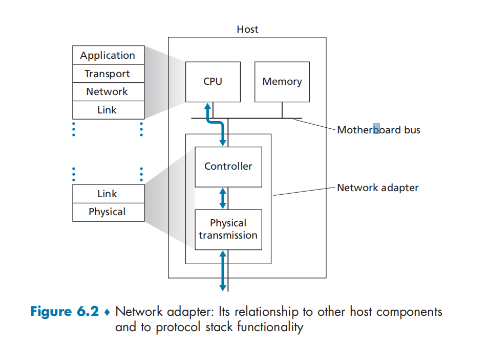

For the most part, the link layer is implemented on a chip called the **network adapter**, also sometimes known as a **network interface controller (NIC)**.

## 6.2 Error-Detection and -Correction Techniques

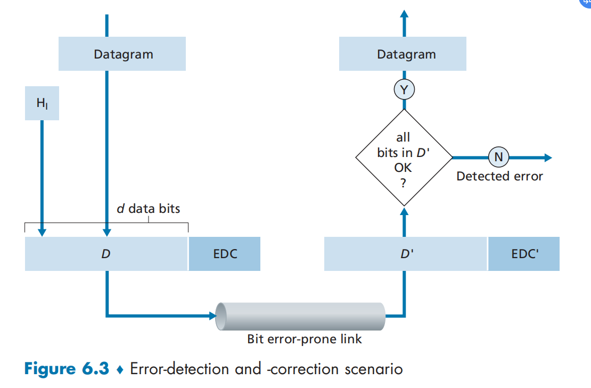

### 6.2.1 Parity Checks

In an even parity scheme, the sender simply includes one additional bit and chooses its value such that the total number of 1s in the d + 1 bits (the original information plus a parity bit) is even.

...

With this **two-dimensional parity** scheme, the parity of both the column and the row containing the flipped bit will be in error. The receiver can thus not only detect the fact that a single bit error has occurred, but can use the column and row indices of the column and row with parity errors to actually identify the bit that was corrupted and correct that error.

The ability of the receiver to both detect and correct errors is known as **forward error correction (FEC)**. 

### 6.2.2 Checksumming Methods

Why is checksumming used at the transport layer and cyclic redundancy check used at the link layer? Recall that the transport layer is typically implemented in software in a host as part of the host's  operating system. Because transport-layer error detection is implemented in software, it is important to have a simple and fast error-detection scheme such as checksumming. On the other hand, error detection at the link layer is implemented in dedicated hardware in adapters, which can rapidly perform the more complex CRC operations.  

###  6.2.3 Cyclic Redundancy Check (CRC)

CRC codes are also known as **polynomial codes**, since it is possible to view the bit string to be sent as a polynomial whose coefficients are the 0 and 1 values in the bit string, with operations on the bit string interpreted as polynomial arithmetic.

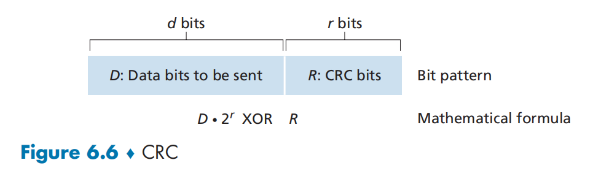

Consider the d-bit piece of data, D, that the sending node wants to send to the receiving node. The sender and receiver must first agree on an r+1 bit pattern, known as a **generator**, which we will denote as G. We will require that the most significant (leftmost) bit of G be 1. The key idea behind CRC codes is shown in Figure 6.6. For a given piece of data, D, the sender will choose r additional bits, R, and append them to D such that the resulting d + r bit pattern is exactly divisible by G. using modulo-2 arithmetic. The process of error checking with CRCs is thus  simple:  The process of error checking with CRCs is thus simple: The receiver divides the d + r received bits by G. If the remainder is nonzero, the receiver knows that an error has occurred; otherwise the data is accepted as being correct.

All CRC calculations are done in modulo-2 arithmetic without carries in addition or borrows in subtraction. This means that addition and subtraction are identical, and both are equivalent to the bitwise exclusive-or of the operands. 

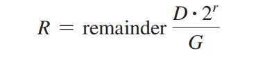

## 6.3 Multiple Access Links and Protocols

There are two types of network links:

- **point-to-point link**. 
- **broadcast link**

How to coordinate the access of multiple sending and receiving nodes to a shared broadcast channel--the **multiple access problem **.

Computer networks similarly have protocols-so-called **multiple access protocols** -- by which nodes regulate their transmission into the shared broadcast channel. 

We can classify just about any multiple access protocol as belonging to one of three categories: **channel partitioning protocols, random access protocols, and  taking-turns protocols**.

### 6.3.1 Channel Partitioning Protocols

TDM has two major drawbacks. First, a node is limited to an average rate of R/N bps even when it is the only node with packets to send. A second drawback is that a node must always wait for its turn in the transmission sequence--again, even when it is the only node with a frame to send. 

FDM divides the R bps channel into different frequencies (each with a bandwidth of R/N) and assigns each frequency to one to the N nodes. It avoids collisions and divides the bandwidth fairly among the N nodes. However, FDM also shares a principal disadvantage with TDM--anode is limited to bandwidth of R/N, even when it is only node with packets to send.

 A third channel partitioning protocol is **code division multiple access (CDMA)**. CDMA assigns a different code to each node. Each node then uses its unique code to encode the data bits it sends. 

### 6.3.2 Random Access Protocols

**Slotted ALOHA**

The operation of slotted ALOHA in each node is imple:

- When the node has a fresh frame to send, it waits until the beginning of the next slot and transmits the entire frame in the slot.
- If there isn't a collision, the node has successfully transmitted its frame and thus need not consider retransmitting the frame. 
- If there is a collision, the node detects the collision before the end of the slot. The node retransmits its frame in each subsequent slot with probability p until the frame is transmitted without a collision.

When there are multiple active nodes, a certain fraction of the slots will have collisions and will therefore be "wasted." The second concern is that another fraction of the slots will be empty because all active nodes refrain from transmitting as a result of the probabilistic transmission policy. 

**ALOHA**

**Carrier Sense Multiple Access (CSMA)**

Specifically, there are two important rules for polite human conversation:

- Listen before speaking. If someone else is speaking, wait until they are finished. In the networking world, this is called **carrier sensing** -- a node listens to the channel before transmitting. 
- If some one else begins talking at the same time, stop talking. In the networking world, this is called **collision detection** -- a transmitting node listens to the channel while it is transmitting. 

These two rules are embodied in the family of **carrier sense multiple access** **(CSMA)** and **CSMA with collision detection (CSMA/CD)** 

### Carrier Sense Multiple Access with Collision Detection (CSMA/CD)

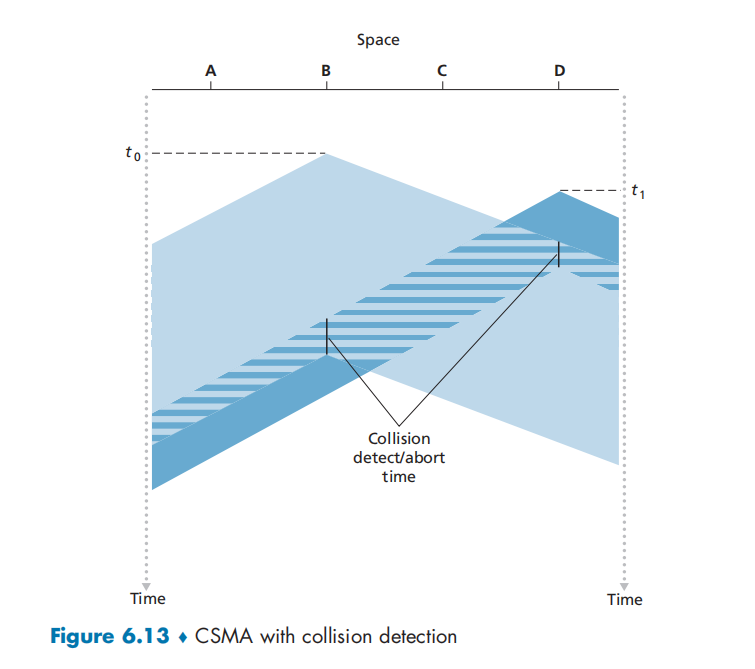

It's operation from the perspective of an adapter attached to a broadcast channel:

- The adapter obtains a datagram from the network layer, prepares a link-layer frame, and puts the frame adapter buffer.
- If the adapter senses that the channel is idle, it starts to transmit the frame. 
- While transmitting, the adapter monitors for the presence of signal energy coming form other adapters using the broadcast channel.
- If the adapter transmits the entire frame without detecting signal energy from other adapters, the adapter is finished with the frame. If, on the other hand, the adapter detects signal energy from other adapters while transmitting, it aborts the transmission (that is, it stops transmitting its frame).
- After aborting, the adapter waits a random amount of time and then returns to step 2.

To determine interval

The **binary exponential backoff** algorithm, 

Specifically, when transmitting a frame that has already experienced n collisions, a node chooses the value of K at random from {0, 1, 2, ..., 2^n-1}

**CSMA/CD Efficiency**

### 6.3.3 Taking-Turns Protocols

Two important protocols

- **polling protocol**.

​		main node -> other nodes send data by turn. eg. Bluetooth

- **token-passing protocol**

​	When a token is passed to a node, the node begin to transmit. 

### 6.3.4 DOCSIS: The Link-Layer Protocol for Cable Internet Access

Data-Over Cable Service Interface Specifications

DOCSIS uses FDM to divide the downstream and upstream network segments into multiple frequecncy channels. 

Frames transmitted on downstream channel by the CMTS are received by all cable modems receiving that channel; however, multiple cable modems share the same upstream channel to the CMTS, and thus collisions can potentially occur.

A cable access network thus serves as a terrific example of multiple access protocols in action -- FDM, TDM, random access, and centrally allocated time slots all within one network!

## 6.4 Switched Local Area Networks

### 6.4.1 Link-Layer Addressing and APR

We'll also cover the Address Resolution Protocol (ARP), which provides a mechanism to translate IP addresses to link-layer addresses.

**MAC Addresses**

In truth, it is not hosts and routers that have link-layer addresses but rather their adapters (that is, network interfaces) that have link-layer addresses. 

however, that link-layer switches do not have link-layer addresses associated with their interfaces that connect to hosts and routers.

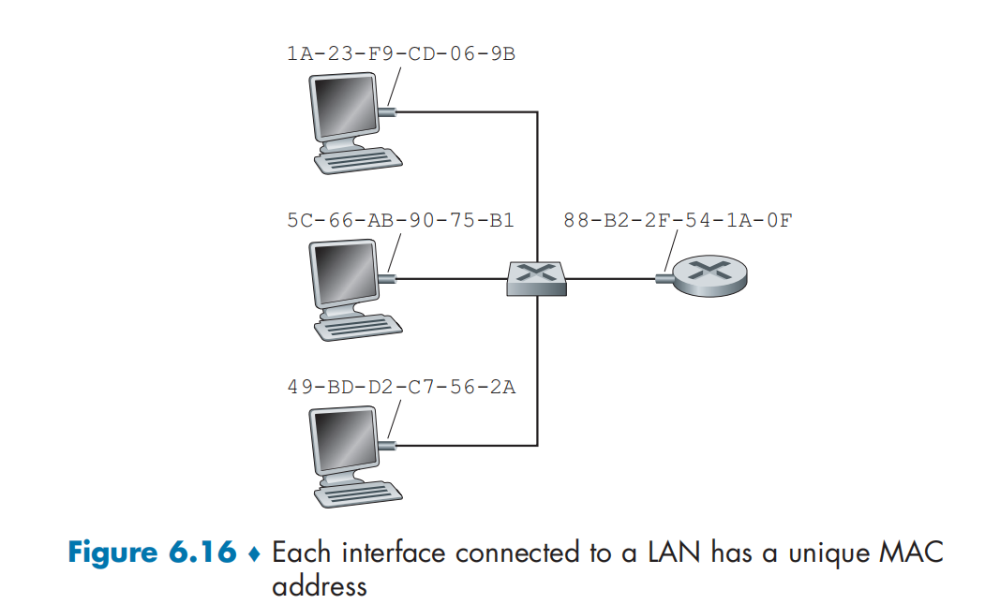

A link layer address is variously called a **LAN address**, a **physical address**, or a **MAC address**. 

One interesting property of MAC addresses is that no two adapters have the same address. 

IEEE manages the MAC address space. 

When an adapter to send a frame to some destination adapter, the sending adapter inserts the destination adapter's MAC address into the frame and then sends the frame into the LAN.

**Address Resolution Protocol (ARP)**

Because there are both network-layer addresses, there is a need to translate between them. For the Internet, this is the job of the **Address Resolution Protocol （ARP)**

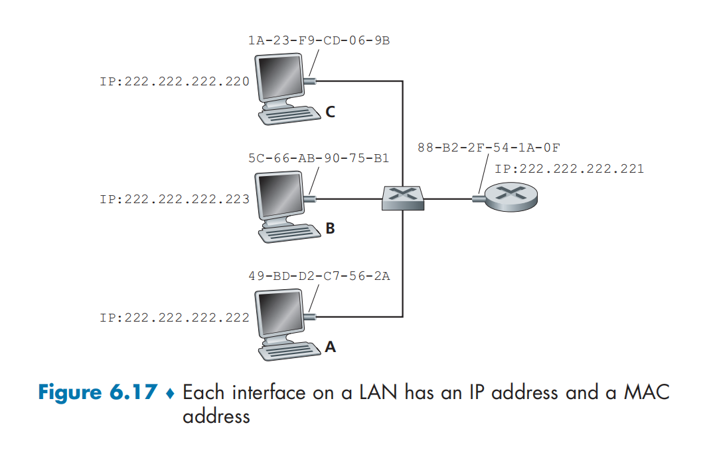

How does the sending host determine the MAC address for the destination host with IP  address 222.222.222.222? As you might have guessed, it uses ARP. 

 An APR module in the sending host takes any IP address on the same LAN as input, and returns the corresponding MAC address. 

Each host and router has an **ARP table** in its memory, which contains mappings of IP addresses to MAC addresses. 

How to query?

First, the sender constructs a special packet called an **ARP packet** . An ARP packet has several fields, including the sending and receiving IP and MAC addresses. The purpose of the ARP query packet is to query all the other hosts and routers on the subnet to determine the MAC address corresponding to the IP address that is being resolved.

222.222.222.220 passes an APR query packet to the adapter along with an indication that the adapter should send the packet to the MAC broadcast address, namely, FF-FF-FF-FF-FF-FF. The adapter encapsulates the ARP packet in a link-layer frame, use the broadcast address for the frame's destination address, and transmits the frame into the subnet.

- The query ARP message is sent within a broadcast frame, whereas the response ARP message is sent within a standard. 
- ARP is plug-and-play; an ARP table gets built automatically.

**Sending a Datagram off the Subset**

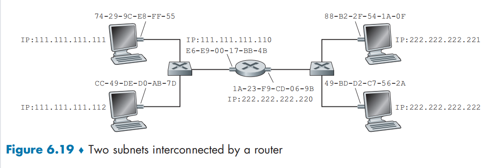

### 6.4.2 Ethernet

...

In the early 2000s, Ethernet experienced yet another major evolutionary change. Ethernet installations continued to use a star topology, but the hub at the center was replaced with a **switch**.

**Ethernet Frame Structure**

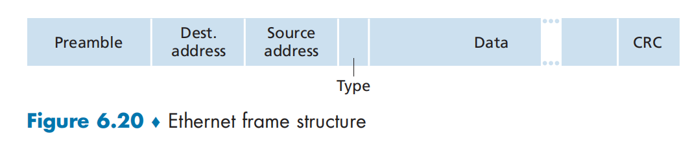

- Data field.
- Destination address
- Source address
- Type field.  Hosts can use other network-layer protocols besides IO.
- Cyclic redundancy check (CRC).
- Preamble. 

All of the Ethernet technologies provide connectionless service to the network layer. That is, when adapter A wants to send a datagram to B, adapter A encapsulates the datagram in an Ethernet frame and sends the frame into the LAN, without first handshaking with adapter B. 

Ethernet technologies provide an unreliable service to the network layer. Specifically, when adapter B receives a frame from adapter A, it runs the frame through a CRC check, but neither sends an acknowledgment when a frame passes the CRC check nor sends a negative acknowledgment when a frame fails the CRC check. When a frame fails the CRC check, adapter B simply discards the frame. Thus, adapter A has no idea whether its transmitted frame reached adapter B and passed the CRC check. 

if the application is using TCP, then TCP in Host B will not acknowledge the data contained in discarded frames, causing TCP in Host A to retransmit.

**Ethernet Technologies**

### 6.4.3 Link-Layer Switches

We'll see that the switch itself is transparent to the hosts and outers in the subnet; that is, a host/router addresses a frame to another host/router and happily sends the frame into the LAN, unware that a switch will be receiving the frame and forwarding it.

**Forwarding and Filtering**

**Filtering** is the switch function that determines whether a frame should be forwarded to some interface or should just be dropped. 

**Forwarding** is the switch function that determines the interfaces to which a frame a frame should be directed, and then moves the frame to those interfaces. 

Switch filtering and forwarding are done with a **switch table**.

An entry in the switch table contains 

1. a MAC address
2. the switch interface that leads toward that MAC address
3. the time at which the entry was placed in the table. 

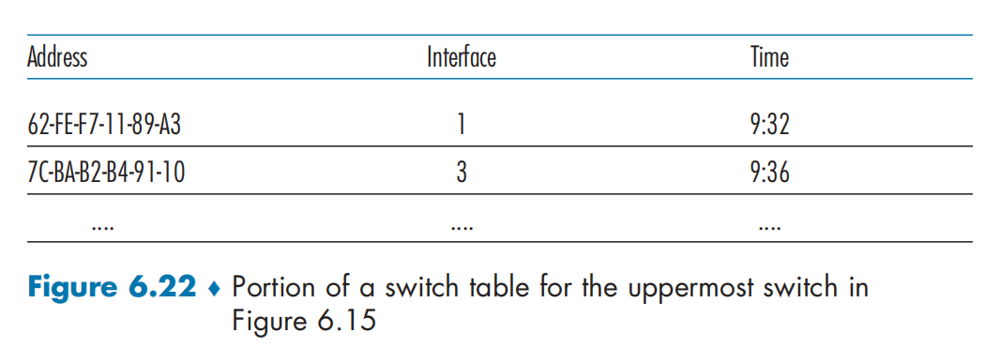

There possible cases:

- There is no entry in the table for DD-DD-DD-DD-DD-DD. if there is no entry for the destination address, the switch broadcasts the frame.
- There is an entry in the table, interface x.  There being no deed to forward the frame to any of the other interfaces, the switch performs the filtering function by discarding the frame. 
- There is an entry in the table, interface y != x. 

How to config table?

**Self-Learning**

The capability is accomplished as fllows:

1. The switch table is initially empty.
2. For each incoming frame received on an interface, the switch stores in its table (1) the MAC address in the frame's source address field (2) the interface from which the frame arrived, and (3) the current time. In this manner, the switch records in its table the LAN segment on which the sender reside. If every host in the LAN eventually sends a frame, then every host will eventually get recorded in the table. 
3. The switch deletes an address in the table if no frames are received with that address as the source address after some period of time. In this manner, if a PC is replaced by another PC, the MAC address of the original PC will eventually be purged from the switch table. 

**Properties of Link Link-Layer Switching**

- Elimination of collisions. 
- Heterogeneous Link.
- Management. 

**Switches Versus Routers**

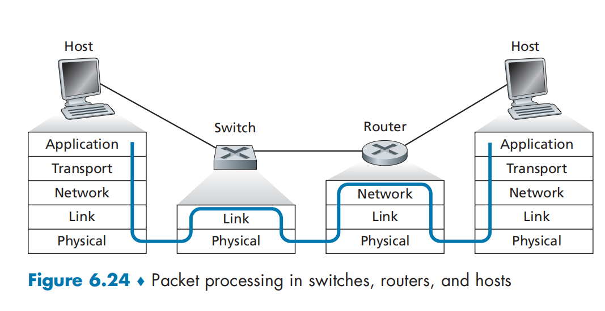

### 6.4.4 Virtual Local Area Networks (VLANs)

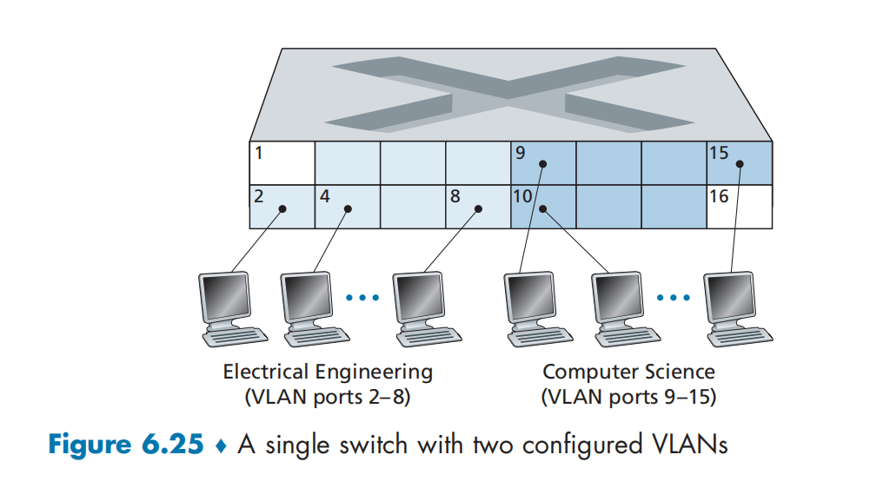

A more scalable approach to interconnecting VLAN switches is known as **VLAN trunking**

## 6.5 Link Virtualization: A Network as a Link Layer

### 6.5.1 Multiprotocol Label Switching (MPLS)

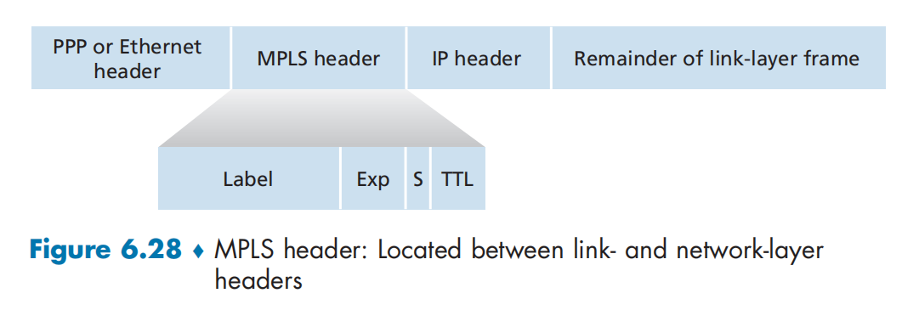

## 6.6 Data Center Networking

### 6.6.1 Data Center Architectures

The worker bees in a data center are the hosts. The hosts in data centers, called **blades** and resembling pizza boxes, are generally commodity hosts that include CPU, memory, and disk storage. The hosts are stacked in racks, with each rack typically having 20 to 40 blades. At the top of  each rack, there is a switch, aptly named the **Top of Rack (TOR) switch**.

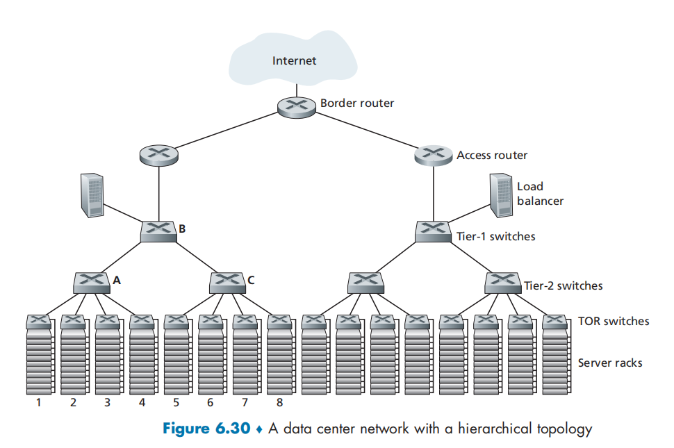

**Load Balancing**

**Hierarchical Architecture**

### 6.6.2 Trends in Data Center Networking

**Cost Reduction**

**Centralized SDN Control and Management**

**Virtualization**

**Physical Constraints**

**Hardware Modularity and Customization**

## 6.7 Retrospective: A Day in the life of a Web Page Request

### 6.7.1 Getting Started: DHCP, UDP, IP and Ethernet

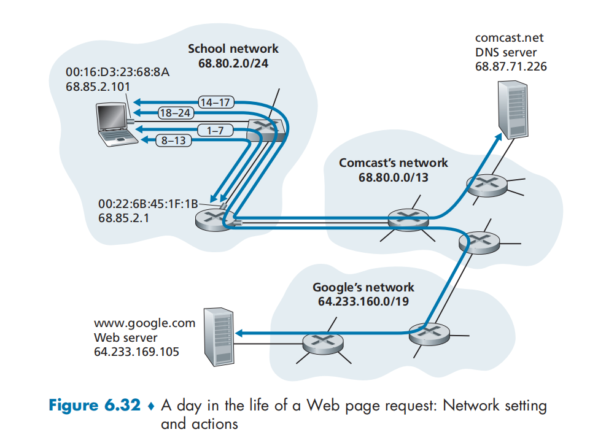

### 6.7.2 Still Getting Started: DNS and ARP

### 6.7.3 Still Getting Started: Intra-Domain Routing to the DNS Server.

### 6.7.4 Web Client-Server Interaction: TCP and HTTP

## 6.8 Summary

