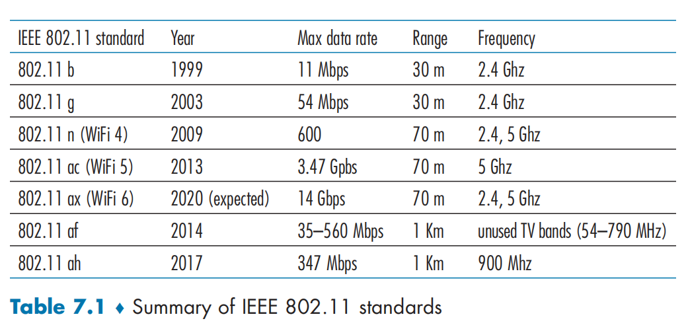
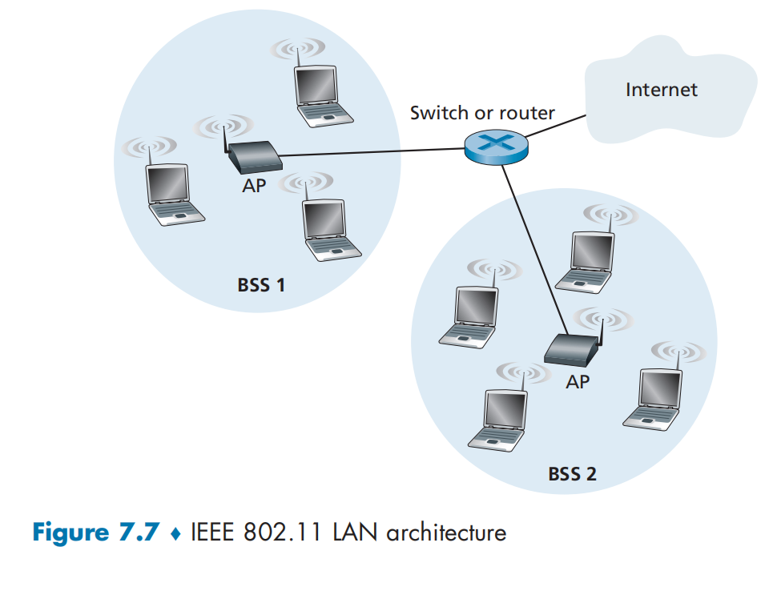
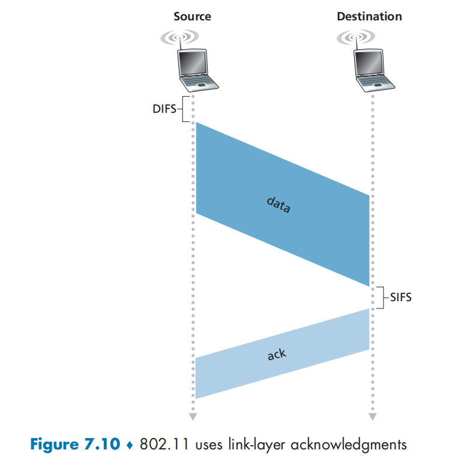
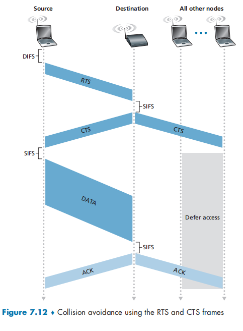
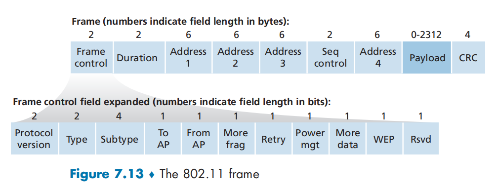
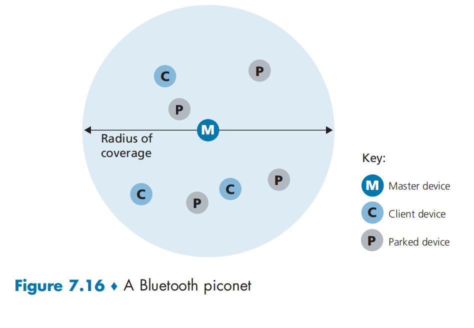

# CHAPTER 7: Wireless and Mobile Networks

## 7.1 Introduction

- **Single-hop, infrastructure-based.** 802.11 networks,  café, of library; and the 4G LTE data networks.
- Single-hop, infrastructure-less. Bluetooth networks.
- Multi-hop, infrastructure-based.  **wireless mesh**
- Multi-hop, infrastructure-less. 

## 7.2 Wireless Links and Network Characteristics

This host receives an electromagnetic signal that is a combination of a degraded form of the original signal transmitted by the sender and background noise in the environment. The **signal-to-noise ratio (SNR)** is a relative measure of the strength of the received signal and this noise. 

...

- For a given modulation scheme. the higher the SNR, the lower the BER. 

### 7.2.1 CDMA

In a CDMA protocol, each bit being sent is encoded by multiplying the bit by a signal that changes at a much faster rate (known as the **chipping rate**) than the original sequence data bits. 

## 7.3 WIFI: 802.11 Wireless LANs

### 7.3.1 The 802.11 Wireless LAN Architecture

The fundamental building block of the 802.11 architecture is the **basic service set (BSS)**. A BSS contains one or more wireless stations an a central **base station**, known as an **access point (AP)** in 802.11 parlance. 

Wireless LANs that deploy APs are often referred to as **infrastructure wireless LANs**, with the "infrastructure" being the APs along with the wired Ethernet infrastructure that interconnects the APs and a router. 

**Channels and Association**

When a network administrator installs an AP, the administrator assigns a one or two-word **Service Set Identifier (SSID)** to the access point. 

The process of scanning channels and listening for beacon frames is known as **passive scanning**. A wireless device can also perform **active scanning**, by broadcasting a probe frame that will be received by all APs within the wireless device's range.

### 7.3.2 The 802.11 MAC Protocol

This random access protocol is referred to as **CSMA with collision avoidance** , or more succinctly as **CSMA/CA**. 

The 802.11 MAC protocol does not implement collision detection. There are two important reasons for this:

- The ability to detect collisions requires the ability to send and receive at the same time. Because the strength of the received signal is  typically very small compared to the strength of the transmitted signal at the 802.11 adapter, it is costly to build hardware that can detect a collision.
- More importantly, even if the adapter could transmit and listen at the same time, the adapter would still not be able to detect all collisions, due to the hidden terminal problem and fading, as discussed in Section 7.2.

In order to reduce the likelihood of collisions, 802.11 employs several collision-avoidance techniques. 

To deal with this non-negligible chance of failure, the 802.11 MAC protocol uses link-layer acknowledgments. 

when the destination station receives a frame that passes the CRC, it waits a short period of time known as the **Short Inter-frame Spacing (SIFS)** and then sends back an acknowledgment fame. 

Suppose that a station has a frame to tranmit.

1. If initially the station senses the channel idle, it transmits its frame after a short period of time known as the **Distributed Inter-frame Space (DIFS)**
2. Otherwise, the station chooses a random backoff value using binary exponential backoff and counts down this value after DIFS when the channel is sensed idle. While the channel is sensed busy, the counter value remains frozen.
3. When the counter reaches zero, the station transmits the entire frame and then waits for an acknowledgment
4. If an acknowledgement is received, the transmitting station knows that its frame has been correctly received at the destination station. If the station has another frame to send, it begins the CSMA/CA protocol at step 2. If the acknowledgement isn't received, the transmitting station reenters the backoff phase in step 2, with the random value chosen from a larger interval.

**Deal with Hidden Terminals: RTS and CTS**

802.11 protocol allows a station to use a **Request to Send (RTS)** control frame and a short  **Clear to Send (CTS)** control frame, it can first send an RTS frame to the AP, indication the total time required to transmit the DATA frame and the acknowledgment (ACK) frame,l When the AP receives the RTS frame, it responds by broadcasting a CTS frame. This CTS frame serves two purposes: It gives the sender explicit permission to send and also instructs the other stations not to send for the reserved duration.

**Using 802.11 as a Point-to-Point Link**

### 7.3.3 The IEEE 802.11 Frame

**Payload and CRC Fields**

**Address Fields**

Four address fields, each of which can hold a 6-byte MAC address. But why four address fields? It turns out that three three address fields are needed for internetworking purposes--specifically, for moving the network-layer datagram from a wireless station through  an AP to a router to a router interface. 

- Address  1 is the MAC address of the station that transmits the frame. 
- Address 1 is the MAC address of the wireless station that is to receive the frame.
- Address 3 contains the MAC address of this router interface.

We should keep in mind that an AP is a link-layer device, and thus neither "speaks" IP nor understands IP addresses. 

When the Ethernet frame arrives at the AP, the AP converts the 802.3 Ethernet frame to an 802.11 frame before transmitting the frame into the wireless channel. 

Thus, address 3 allows the AP to determine the appropriate destination MAC address when constructing the Ethernet frame.

**Sequence Number, Duration, and Frame Control Fields**

the use of sequence numbers allows the receiver to distinguish between a newly transmitted frame and the retransmission of a previous frame. 

### 7.3.4 Mobility in the Same IP Subnet

### 7.3.5 Advanced Features in 802.11

**802.11 Rate Adaptation**

**Power  Management**

### 7.3.6 Personal Area Networks: Bluetooth

Bluetooth networks are sometimes referred to as **wireless personal area networks** (WPANs) or **piconets**.

The Bluetooth wireless channel is operated in a TDM manner, with time slots of 625 microseconds. 

During each time slot, a sender transmits on one of 79 channels, with the channel changing in a known but pseudo-random manner from slot to slot. This form of channel hopping, know as **frequency-hopping spread spectrum** (FHSS), is used so that interference from another device or appliance operating in the ISM band will only interfere with Bluetooth communications in at most a subset of the slots. 

## 7.4 Cellular Networks: 4G and 5G

### 7.4.1 4G LTE Cellular Networks: Architecture and Elements

- Mobile Device. The mobile  device also has a globally unique 64-bit identifier called the **International Mobile Subscriber Identity (IMSI)**, 
- Base station. 
- Home Subscriber Server (HSS)
- Mobility Management Entity (MME).

### 7.4.2 LTE Protocols Stacks

LTE divides the mobile device's link layer into these sublayers:

- Packet Data Convergence.
- Radio Link Control. 
- Medium Access Control (MAC).

### 7.4.3 LET Radio Access Network

### 7.4.4 Additional LET Functions: Network Attachment and Power Management

### 7.4.5 The Global Cellular Network: A Network of Networks

### 7.4.6 5G Cellular Networks

